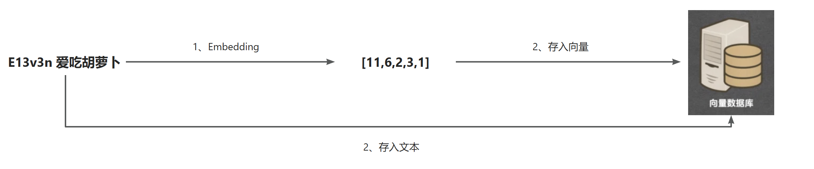
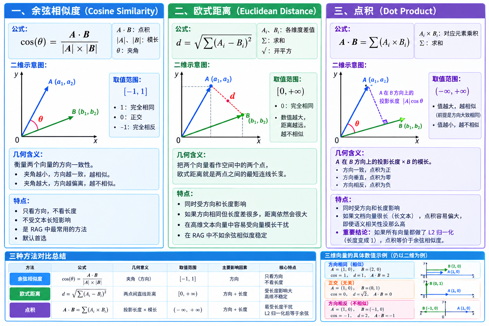

# 0x01 ~ 什么是RAG

**RAG（Retrieval-Augmented Generation）**，中文叫做 **检索增强生成**。

**RAG** 是一种让 **LLM** 在回答问题前，先从**外部知识库**中**“查资料”**，再根据查到的内容生成答案的技术架构。

> 典型的 **RAG** 系统由两部分构成：
>
> - 检索器负责从知识库中找出相关片段
> - 生成器拿到这些片段作为上下文来生成答案


# 0x02 ~ 为什么需要RAG

一种技术的出现往往就是来解决一些问题的。

**大语言模型(LLM)** 存在一些局限性：

> 1、时效性：大模型的知识会过时。大模型的训练数据有截止时间。比如模型训练到 2024 年，它就不可能知道 2025 年发生的事。
>
> 2、幻觉问题：大模型易出现幻觉。模型有时会一本正经地编造事实，尤其是在大模型不具备某一方面的知识或不擅长的任务场景。
>
> 3、大模型是一种通用模型，不知道私有数据。企业内部的文档、客服记录、产品手册、代码库、会议纪要，这些数据不在公开训练集里，模型不可能知道。

**RAG** 就是解决上述问题的有效方案。


# 0x03 ~ RAG的流程

## 核心流程

**RAG** 的核心流程是： **检索相关片段 → 注入上下文 → LLM基于上下文生成答案**


## 整体流程

**RAG** 的整体流程是：

- 准备部分：
  - 分片：将文档切割成多个片段
  - 索引：通过 **Embedding** 将片段文本转换为向量，将片段文本和片段向量存入向量数据库中
    - **Embedding**：把文本转换成向量的一个过程。含义相近的文本在经历了 **Embedding** 之后，它们对应的向量也是相近的。
    - **向量数据库**：存放和管理向量，这些向量是数据的数值表示法，能够以获取其意义和关系的方式处理文本、图像和其他内容。
- 回答部分：
  - 召回：先把可能相关的片段找出来
    - 向量相似度计算方法
      - 余弦相似度
      - 欧式距离
      - 点积
  - 重排：精挑细选，把最相关的排前面
    - 常用方法为 **Cross - Encoder**
      - 把 Query 和 Document 放在同一个模型里，让 Transformer 直接学习两者之间的交互关系，打分。
  - 生成：让 **LLM** 基于筛选后的资料回答，把用户问题和重排后的高质量片段拼成 **Prompt**，交给 **LLM**。


### 向量数据库

向量入库动作：



向量数据库的内部数据：

|         文本          |       向量       |
| :-------------------: | :--------------: |
| **E13v3n 爱吃胡萝卜** | **[11,6,2,3,1]** |


### 向量相似度计算方法




# 0x04 ~ 构建 RAG 系统

使用 B站UP主 马克 的GitHub代码仓库来学习，[https://github.com/MarkTechStation/VideoCode/tree/main/使用Python构建RAG系统/rag](https://github.com/MarkTechStation/VideoCode/tree/main/使用Python构建RAG系统/rag)

**分片**

 ```python
 from typing import List
 
 def split_into_chunks(doc_file: str) -> List[str]:
     with open(doc_file, 'r', encoding = "UTF-8") as file:
         content = file.read()
 
     return [chunk for chunk in content.split("\n\n")]
 
 chunks = split_into_chunks("doc.md")
 
 for i, chunk in enumerate(chunks):
     print(f"[{i}] {chunk}\n")
 ```

**索引**

```python
from sentence_transformers import SentenceTransformer

embedding_model = SentenceTransformer("shibing624/text2vec-base-chinese")

def embed_chunk(chunk: str) -> List[float]:
    embedding = embedding_model.encode(chunk, normalize_embeddings=True)
    return embedding.tolist()


embedding = embed_chunk("测试内容")
print(len(embedding))
print(embedding)
```

```py
import chromadb

chromadb_client = chromadb.EphemeralClient()
chromadb_collection = chromadb_client.get_or_create_collection(name="default")

def save_embeddings(chunks: List[str], embeddings: List[List[float]]) -> None:
    for i, (chunk, embedding) in enumerate(zip(chunks, embeddings)):
        chromadb_collection.add(
            documents=[chunk],
            embeddings=[embedding],
            ids=[str(i)]
        )

save_embeddings(chunks, embeddings)
```

**召回**

```python
def retrieve(query: str, top_k: int) -> List[str]:
    query_embedding = embed_chunk(query)
    results = chromadb_collection.query(
        query_embeddings=[query_embedding],
        n_results=top_k
    )
    return results['documents'][0]

query = "哆啦A梦使用的3个秘密道具分别是什么？"
retrieved_chunks = retrieve(query, 5)

for i, chunk in enumerate(retrieved_chunks):
    print(f"[{i}] {chunk}\n")
```

**重排**

```python
from sentence_transformers import CrossEncoder

def rerank(query: str, retrieved_chunks: List[str], top_k: int) -> List[str]:
    cross_encoder = CrossEncoder('cross-encoder/mmarco-mMiniLMv2-L12-H384-v1')
    pairs = [(query, chunk) for chunk in retrieved_chunks]
    scores = cross_encoder.predict(pairs)

    scored_chunks = list(zip(retrieved_chunks, scores))
    scored_chunks.sort(key=lambda x: x[1], reverse=True)

    return [chunk for chunk, _ in scored_chunks][:top_k]

reranked_chunks = rerank(query, retrieved_chunks, 3)

for i, chunk in enumerate(reranked_chunks):
    print(f"[{i}] {chunk}\n")
```

**生成**

```python
from dotenv import load_dotenv
from google import genai

load_dotenv()
google_client = genai.Client()

def generate(query: str, chunks: List[str]) -> str:
    prompt = f"""你是一位知识助手，请根据用户的问题和下列片段生成准确的回答。

用户问题: {query}

相关片段:
{"\n\n".join(chunks)}

请基于上述内容作答，不要编造信息。"""

    print(f"{prompt}\n\n---\n")

    response = google_client.models.generate_content(
        model="gemini-2.5-flash",
        contents=prompt
    )

    return response.text

answer = generate(query, reranked_chunks)
print(answer)
```

