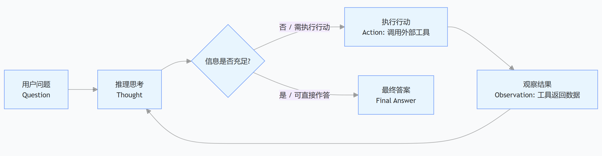

# ReAct

## 0x01 ~ 什么是ReAct循环

**ReAct**是Agent执行任务的核心模式，从**ReAct**的名字上看：

**ReAct = Reasoning + Acting**

实际上，**ReAct**包括了三个环节，即**思考/推理（Thought / Reasoning）**、**行动（Acting）**、**观察（Observing）**。


## 0x02 ~ ReAct的核心流程

**ReAct**的核心流程就是**推理和行动的交织循环**，即`想→做→看→想→做→看`的循环。

**ReAct** 循环从用户提问开始。模型根据当前消息进行推理，判断信息是否足够；若不足，则决定调用哪个工具并生成调用参数，由执行器执行工具。工具返回结果后，模型观察结果，进入下一轮推理。若此时信息已足够，模型直接输出最终答案，循环结束；否则继续下一轮。

> 不过，ReAct 并不是是死循环。在实际工程实现中，通常会设置**最大迭代次数（Max Iterations）**或**超时时间（Timeout）**，以防止模型陷入死循环或无限调用工具。




## 0x03 ~ ReAct 的结构化实现：Function Calling

这里使用LangChain结构化实现，使用的是硅基流动中转站的模型

```python
# weather.py
# agent调用的工具定义

import requests
import json

weather_URL = "https://uapis.cn/api/v1/misc/weather"

def get_weather(city):
    data = requests.get(weather_URL,params={"city": city})
    if data.status_code == 200:
        return data.json()
    else:
        print("天气API请求失败，状态码：", data.status_code)
        return None
```

```python
import os
from dotenv import load_dotenv

load_dotenv(override=True)

from langchain.chat_models import init_chat_model
from weather import get_weather

BASE_URL = os.environ.get("BASE_URL")
SILICONFLOW_API_KEY = os.environ.get("SILICONFLOW_API_KEY")

SYSTEM_PROMPT = "你是一名天气查询助手，你可以帮助用户查询城市天气。"
TOOLS = [get_weather]
MAX_ITERATIONS = 10


def init_model():
    model = init_chat_model(
        model="Qwen/Qwen3.6-27B",
        model_provider="openai",
        base_url=BASE_URL,
        api_key=SILICONFLOW_API_KEY,
    )
    return model


def init_messages():
    return [{"role": "system", "content": SYSTEM_PROMPT}]


def execute_tool(tool_call):
    tool_name = tool_call["name"]
    tool_args = tool_call.get("args", {})
    tool_call_id = tool_call["id"]

    if tool_name == "get_weather":
        city = tool_args.get("city")
        weather_info = get_weather(city)
        if weather_info:
            return {
                "role": "tool",
                "content": f"天气信息: {weather_info}",
                "tool_call_id": tool_call_id,
            }
        return {
            "role": "tool",
            "content": "获取天气信息失败。",
            "tool_call_id": tool_call_id,
        }
    else:
        return {
            "role": "tool",
            "content": f"未知工具: {tool_name}",
            "tool_call_id": tool_call_id,
        }


def agent_loop(model, messages):
    model_with_tools = model.bind_tools(tools=TOOLS)

    while True:
        user_input = input("You: ")
        if user_input.lower() == "exit":
            print("退出对话。")
            break

        messages.append({"role": "user", "content": user_input})

        for i in range(MAX_ITERATIONS):
            response = model_with_tools.invoke(messages)
            messages.append(response)

            if not response.tool_calls:
                print("AI:", response.content)
                break

            for tool_call in response.tool_calls:
                tool_msg = execute_tool(tool_call)
                messages.append(tool_msg)
        else:
            print("AI: 达到最大迭代次数，停止。")


def main():
    model = init_model()
    messages = init_messages()
    agent_loop(model, messages)


if __name__ == "__main__":
    main()
```


## 0x04 ~ 代码执行流程

以0x03的代码为例，其执行流程如下：

> main()
>  ├─ init_model()      创建模型
>  ├─ init_messages()   初始化上下文（system prompt）
>  └─ agent_loop()      ReAct 循环入口
>       └─ while True            外层：多轮对话
>            ├─ 读用户输入
>            ├─ 追加 user 消息
>            └─ for i in range(MAX_ITERATIONS)   内层：ReAct 循环
>                 ├─ model_with_tools.invoke(messages)   ← Thought + Action
>                 ├─ 追加 assistant 消息
>                 ├─ 判断 response.tool_calls
>                 │    ├─ 为空 → 输出最终答案，break
>                 │    └─ 不为空 → 逐个执行工具
>                 │         ├─ execute_tool(tool_call)   ← Action 执行
>                 │         └─ 追加 tool 消息            ← Observation
>                 └─ 回到 for，进入下一轮推理


### **一次完整的执行追踪**：

#### 第一轮：

`messages` 状态：

```python
messages = [
    {"role": "system", "content": "你是一名天气查询助手，你可以帮助用户查询城市天气。"},
    {"role": "user",   "content": "北京"},
]
```

`Model` 进行推理思考，决策是否调用工具：

```python
response = model_with_tools.invoke(messages)
```

模型返回的是 `AIMessage` ：

```python
AIMessage(
    content='\n\n',
    tool_calls=[{
        "name": "get_weather",
        "args": {"city": "北京"},
        "id": "01a0c341cd4b02c3288793ff7ecf7c03",
        "type": "tool_call"
    }],
    response_metadata={
        "finish_reason": "tool_calls",
        "model_name": "Qwen/Qwen3.6-27B",
        ...
    },
    usage_metadata={
        "input_tokens": 275,
        "output_tokens": 465,
        "output_token_details": {"reasoning": 439},
        ...
    }
)
```

追加 `assistant` 消息：

```python
messages.append(response)          # 追加 assistant 消息（含 tool_calls）
```

此时 `messages` 为：

```python
[
    {"role": "system", "content": "你是一名天气查询助手..."},
    {"role": "user",   "content": "北京"},
    AIMessage(
        content='\n\n',
        tool_calls=[{
            "name": "get_weather",
            "args": {"city": "北京"},
            "id": "01a0c341cd4b02c3288793ff7ecf7c03",
            "type": "tool_call"
        }],
        ...
    ),
]
```

执行工具，追加 `tool` 后

```python
for tool_call in response.tool_calls:
    tool_msg = execute_tool(tool_call)
    messages.append(tool_msg)
```

此时 `messages` 是：

```python
[
    {"role": "system", "content": "你是一名天气查询助手..."},
    {"role": "user",   "content": "北京"},
    AIMessage(
        content='\n\n',
        tool_calls=[{
            "name": "get_weather",
            "args": {"city": "北京"},
            "id": "01a0c341cd4b02c3288793ff7ecf7c03",
            "type": "tool_call"
        }],
        ...
    ),
    {
        "role": "tool",
        "content": "天气信息: {'province': '北京市', 'city': '北京', 'weather': '晴', 'temperature': 28, ...}",
        "tool_call_id": "01a0c341cd4b02c3288793ff7ecf7c03"
    }
]
```

#### 第二轮：

```python
response = model_with_tools.invoke(messages)
```

模型看到 `tool` 消息中有天气数据，返回：

```python
AIMessage(
    content="北京今天晴，气温 28℃，西南风 3 级，湿度 39%……",
    tool_calls=[],
    response_metadata={"finish_reason": "stop", ...}
)
```

判断并退出

```python
if not response.tool_calls:
    print("AI:", response.content)
    break
```

当前这一次用户请求的 `ReAct` 循环结束。


## 0x05 ~ 消息角色对照表

`0x04` 中的消息与 `ReAct` 环节的对应

| 消息                                      | 角色/role   | ReAct 环节                 |
| :---------------------------------------- | :---------- | :------------------------- |
| `system`                                  | `system`    | 设定身份                   |
| `user`                                    | `user`      | Question                   |
| `AIMessage(tool_calls=[...])`             | `assistant` | Thought(Thinking) + Action |
| `{"role": "tool", ...}`                   | `tool`      | Observation                |
| `AIMessage(content="...", tool_calls=[])` | `assistant` | Final Answer               |

```markdown
- system 不在ReAct循环中，循环起点是user
- system 为背景约束
```

