# 0x01 前置知识

**NAT（Network Address Translation）：**网络地址转换。通过将一个外部 IP 地址和端口映射到更大的内部 IP 地址集来转换 IP 地址。

如下图，web1 使用了 **NAT**（一般，都是进行端口映射），由防火墙将公网 IP 的特定端口映射到内网 web1 的真实 IP（172.16.0.253）上，使得公网 PC 可以通过访问防火墙的公网 IP 来访问到内网中的 web1。

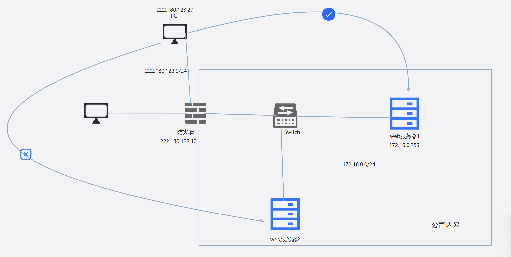

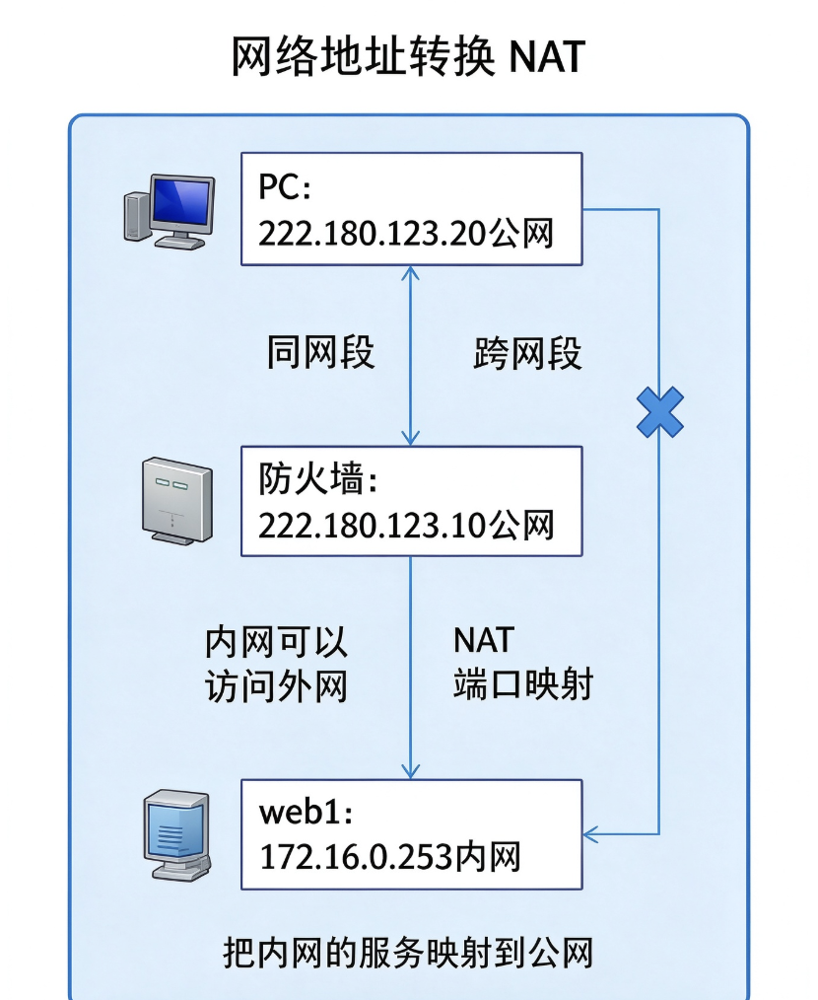

# 0x02 漏洞原理

## SSRF 的介绍

**SSRF**：服务器请求伪造（是一种由攻击者形成服务器端发起的安全漏洞，本质上是属于信息泄露漏洞）。

## SSRF 的攻击目标

**SSRF** 的攻击目标：从外网无法访问的内部系统

## SSRF 形成的原因

**SSRF** 形成的原因：大部分是由于服务端提供了从其他服务器应用获取数据的功能，且没有对目标地址做过滤限制。

> - 从指定URL地址获取网页文本内容
> - 加载指定地址的图片下载
> - 百度识图，给出一串URL就能识别出图片
>
> 以上都有可能实现 **SSRF**

## SSRF 的攻击方式

**SSRF** 的攻击方式：借助提供公网服务的主机 A 向主机 B发起请求，从而获取主机 B 的一些信息。

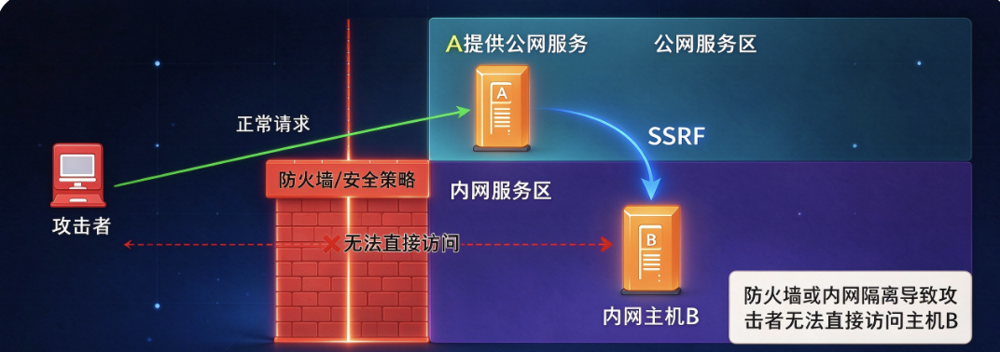

## SSRF 漏洞利用

### 演示流程

通过服务器A（即SSRF服务器）访问A所在内网的其他服务器http://172.250.250.4

由SSRF服务器发送http伪协议连接给Codeexec服务器

Codeexec服务器回复到SSRF服务器

SSRF服务器收到回复后会显示内容

### 漏洞利用

利用服务器 A （SSRF 服务器） 访问 A 所在内网的其他服务器获取信息，进而利用 SSRF 实现其他漏洞利用。

- 利用 file 协议读取本地文件
- 对服务器所在内网、本地进行端口扫描，获取一些服务的 banner 信息
- 攻击运行在内网或本地的应用程序
- 对内网 web 应用进行指纹识别，识别企业内部的资产信息
- 攻击内外网的 web 应用，主要是使用 HTTP GET 请求就可以实现的攻击

# 0x03 SSRF 的利用方式

## SSRF 信息收集

### 伪协议

> file://	从文件系统中获取文件内容，如file:///etc/passwd
>
> dict://	字典服务协议，访问字典资源，如dict:///ip:6739/info
>
> ftp://	可用于网络端口扫描
>
> sftp://	ssh文件传输协议或安全文件传输协议
>
> ldap://	轻量级目录访问协议
>
> tftp://	简单文件传输协议
>
> gopher://	分布式文档传递服务

### file伪协议

> file:// 从文件系统中获取文件内容，格式：file://[文件路径]

| 命令                      | 作用                              |
| ------------------------- | :-------------------------------- |
| file:///etc/passwd        | 读取文件passwd                    |
| file:///etc/hosts         | 显示当前操作系统网卡的ip          |
| file:///proc/net/arp      | 显示arp缓存表（寻找内网其他主机） |
| file:///proc/net/fib_trie | 显示当前网段路由信息              |

### dict伪协议

> 可以实现对 tcp 端口的探查

| 使用场景            | Payload 示例                           | 实际发送/行为                    | 判断依据 / 返回                                              |
| :------------------ | :------------------------------------- | :------------------------------- | :----------------------------------------------------------- |
| 基础端口探测        | `dict://127.0.0.1:22`                  | 后端尝试连接目标 `IP:端口`       | 端口开放则连接成功，可能返回 Banner 或超时差异；关闭则报错/超时 |
| HTTP 服务识别       | `dict://127.0.0.1:80/info`             | 向 80 端口发送 `info\r\n`        | HTTP 服务器通常返回 `400 Bad Request` 等错误，可辅助判断为 HTTP 服务 |
| Redis 未授权检测    | `dict://127.0.0.1:6379/info`           | 向 Redis 发送 `INFO\r\n`         | 未授权时直接返回 Redis 版本、运行模式、内存等信息            |
| Redis 统计信息      | `dict://127.0.0.1:6379/stats`          | 发送 `STATS\r\n`                 | 返回 Redis 统计信息                                          |
| 执行单行 Redis 命令 | `dict://127.0.0.1:6379/CONFIG GET dir` | 发送 `CONFIG GET dir\r\n`        | 返回 Redis 配置的当前目录                                    |
| 探测 Memcached      | `dict://127.0.0.1:11211/stats`         | 发送 `stats\r\n`                 | Memcached 返回统计信息                                       |
| 探测其他文本协议    | `dict://127.0.0.1:端口/命令`           | 向目标端口发送 `命令\r\n`        | 根据回显识别服务或版本                                       |
| 盲 SSRF 端口扫描    | `dict://127.0.0.1:端口`                | 后端尝试连接                     | 通过响应时间长短、错误信息差异判断端口是否开放               |
| DICT 服务自身探测   | `dict://127.0.0.1:2628/info`           | 访问 DICT 服务                   | 返回 DICT 服务信息                                           |
| 协议格式说明        | `dict://<host>:<port>/<command>`       | 忽略认证部分，直接向目标发送命令 | 命令末尾自动追加 `\r\n`                                      |

### http协议

> **协议说明**：`http://` 是标准协议（非伪协议）。在 SSRF 漏洞中，后端会以 HTTP/1.1 的 GET 请求（或 POST）访问攻击者指定的 URL。
>
> **利用场景**：用于探测内网或本地开放的 Web 服务，读取 Web 资源，或配合字典进行目录爆破（目录扫描）

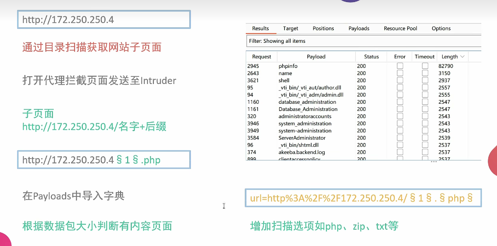

### gopher伪协议（SSRF的基础利用）

> **为什么要使用 gopher 伪协议**？
>
> gopher协议可以构造并发送任意TCP数据流。在SSRF中，它允许我们绕过常规HTTP请求的限制，直接向目标内网服务发送原始数据，实现完整的数据提交（如完整的HTTP请求报文、Redis命令序列等）。
>
> **利用范围较广**：GET提交、POST提交、Redis、Fastcgi、SQL等。
>
> **基本格式**：gopher://<host>:<port>/_<urlencoded-data>
>
> - 默认端口：70
> - Web端口：80
> - **关键点**：`_` 后面的所有数据都会被作为TCP流发送。**必须进行URL编码**（尤其是换行符和特殊字符）

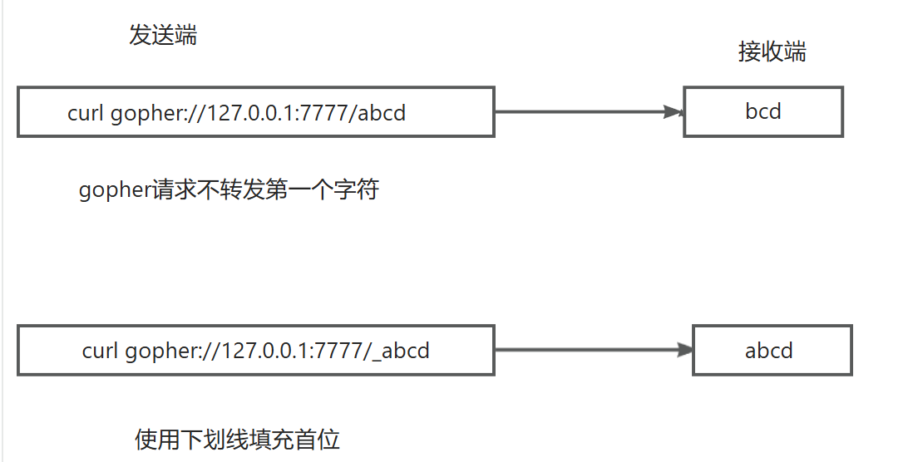

#### GET 提交

需要保留头部信息：

1、路径：GET/name.php?name=benben HTTP/1.1

2、目标IP地址： Host: 172.250.250.4

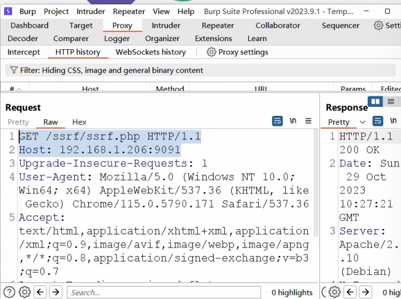

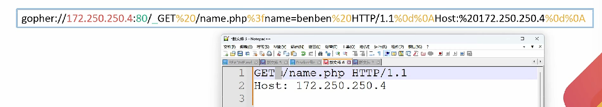

tips：

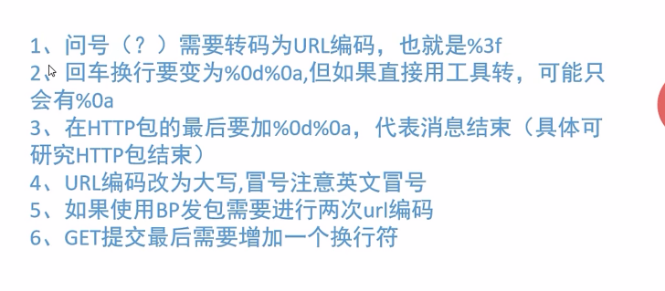

#### POST 提交

需要保留头部信息：

1、POST

2、Host:

3、Content-Type:

4、Content-Length:

Content-Length一定要和提交的数据的实际长度对应起来，不然就会出错。

gopher://172.250.250.4:80/_

gopher格式不变

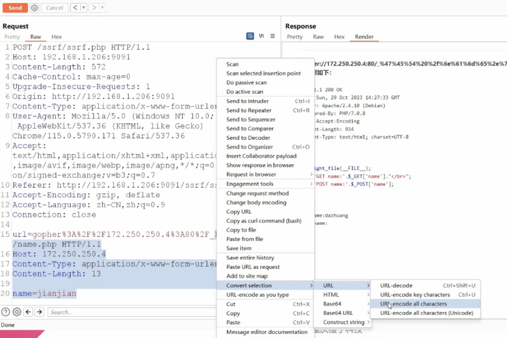

> note：
>
> `_` 后的要经过两次 url 编码，原因是攻击者会先经过 SSRF 服务器，然后去访问 Codeexec 服务器，会经历两次 url 解码。

# 0x04 SSRF 一些绕过姿势

## 环回地址绕过

可以使用编码绕过对 127.0.0.1 的检测限制

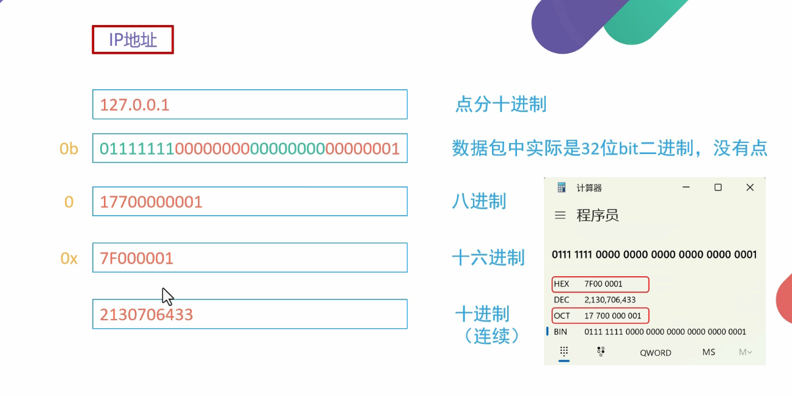

## 302重定向绕过 IP 限制

针对私网地址被限制的情况下，使用302重定向

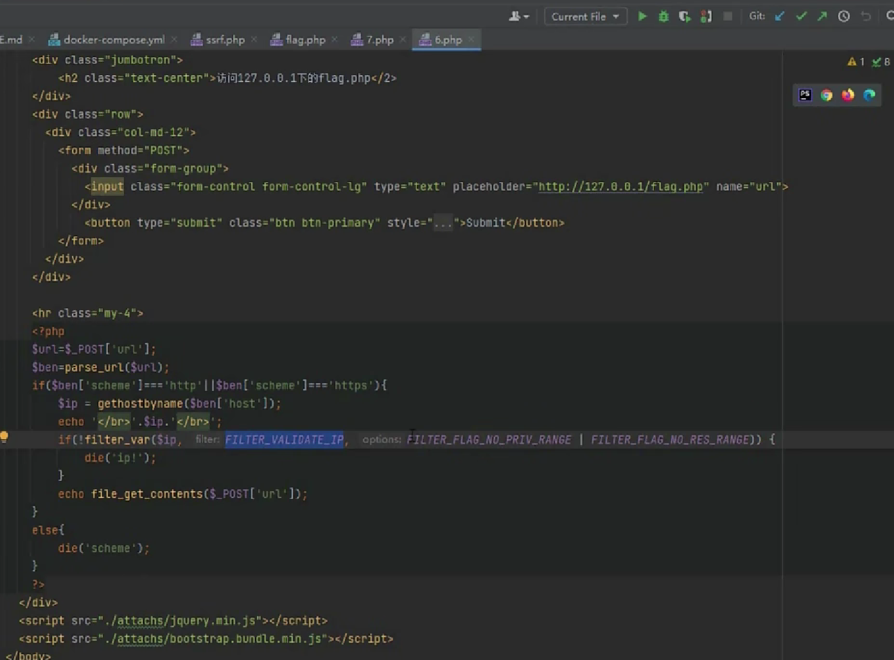

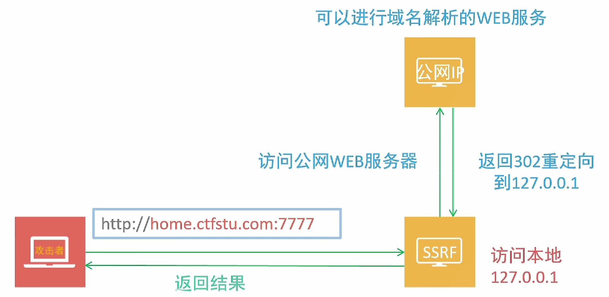

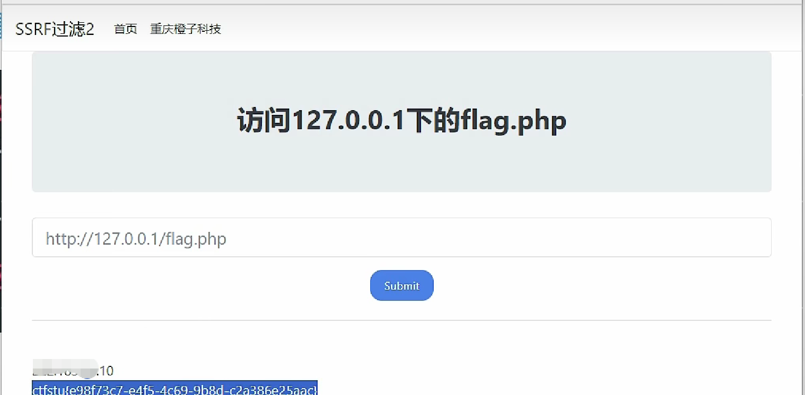

## DNS 重绑定绕过

> 防御：
>
> 1、解析目标URL，获取其Host
>
> 2、解析Host，获取Host指向的IP地址
>
> 3、检查IP地址是否为内网地址
>
> 4、请求URL
>
> 5、如果有跳转，拿出跳转URL，执行1
>
> 
>
> 可以有效限制：直接访问内网IP；302跳转；xip.io/xip.name及短链接变换等URL变形；畸形URL；iframe攻击；IP进制攻击。
>
>
> 针对这种防御可以使用 DNS Rebinding Attack （DNS 重绑定攻击）

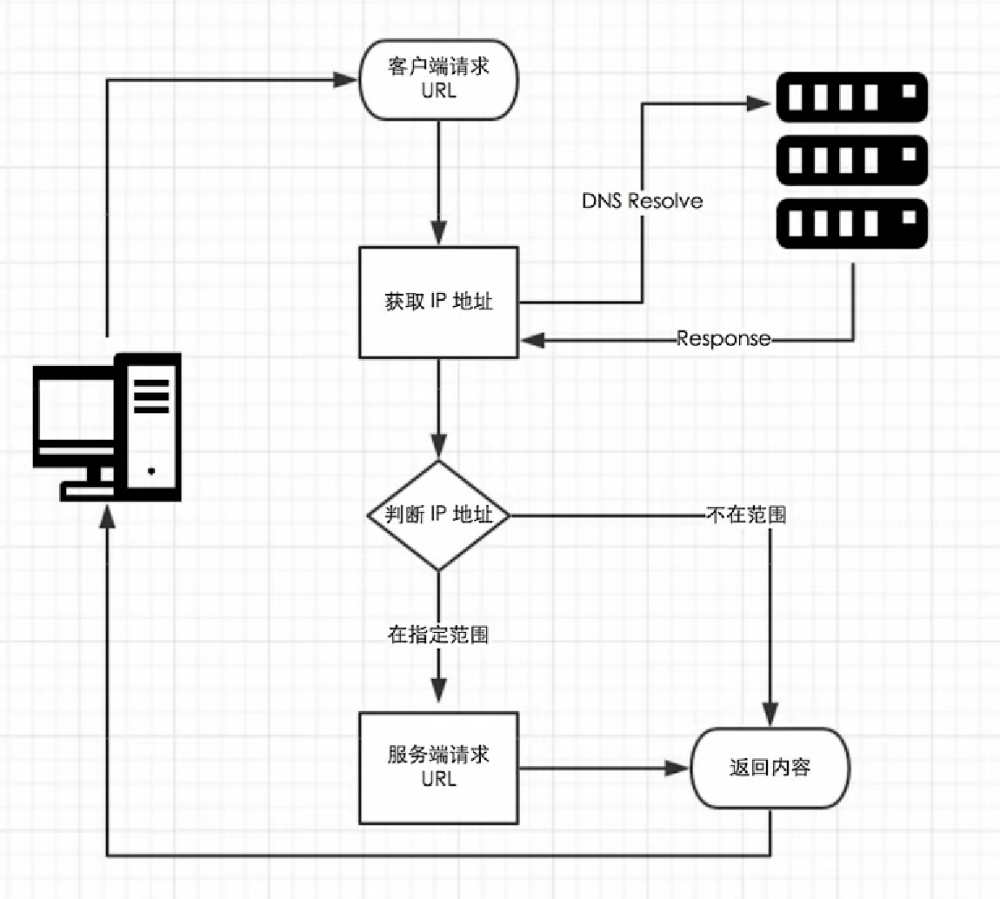

### **攻击原理**

利用服务器两次解析同一域名的短暂间隙，更换域名背后的 IP 达到突破同源策略或绕过 WAF 进行 SSRF 的目的。

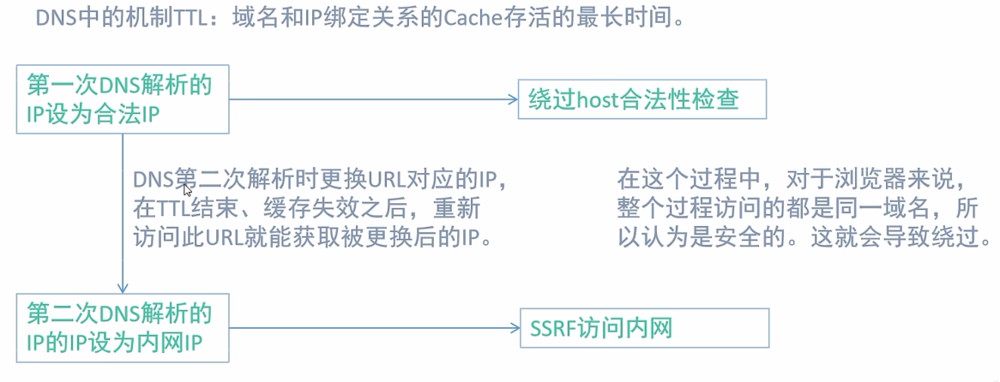

http://lock.cmxchg8b.com/rebinder.html
